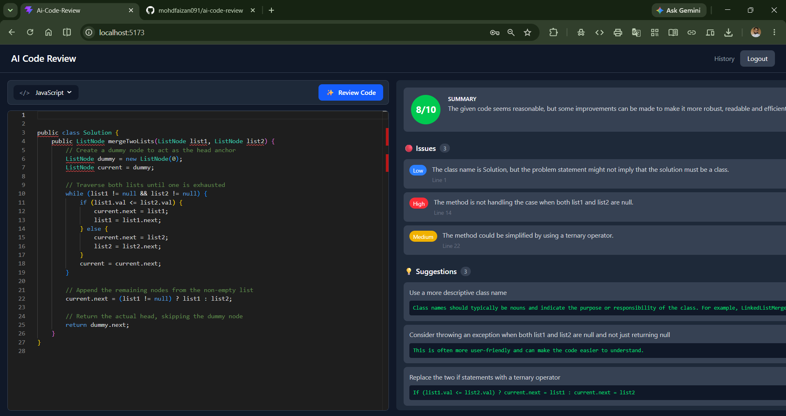
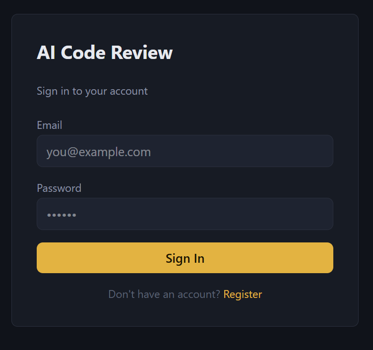
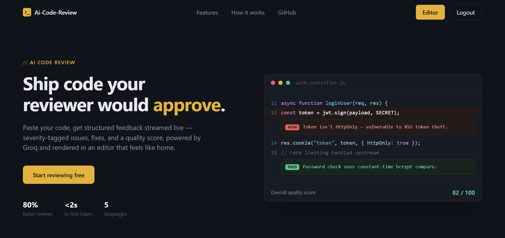

# AI Code Review Tool

A full-stack web application that provides instant, AI-powered code reviews using real-time streaming. Paste your code, get structured feedback on issues, suggestions, and an overall quality score — streamed live as the AI analyzes it.

**Live Demo:** [ai-code-review-olive.vercel.app](https://ai-code-review-olive.vercel.app)

---

## Features

- **Live AI Code Review** — Get instant feedback streamed token-by-token using Server-Sent Events (SSE), just like ChatGPT
- **Structured Feedback** — Issues categorized by severity (high/medium/low), actionable suggestions with code fixes, and an overall quality score
- **Monaco Editor Integration** — The same code editor that powers VS Code, with syntax highlighting for multiple languages
- **Guest Mode** — Try the editor without an account; sign up only when you're ready to review
- **Secure Authentication** — JWT-based auth with HttpOnly cookies, protected against XSS and CSRF
- **Review History** — All past reviews are saved and accessible with pagination
- **Multi-language Support** — JavaScript, TypeScript, Python, Java, C++

---

## Tech Stack

**Frontend**
- React + Vite
- Tailwind CSS
- Monaco Editor
- React Router

**Backend**
- Node.js + Express
- MongoDB Atlas + Mongoose
- JWT Authentication (HttpOnly Cookies)
- Zod (request & environment validation)
- Server-Sent Events (SSE) for streaming

**AI**
- Groq API (`llama-3.1-8b-instant`) for fast, low-latency code analysis
- Zod schema validation on AI responses (not just JSON parsing, but structural validation) to catch malformed LLM output before persisting
- Few-shot prompting — a worked example included in the prompt alongside instructions, for consistent output formatting
- Temperature-tuned prompting (`temperature: 0.2`) for consistent, analytical output over creative variance

**Deployment**
- Frontend: Vercel
- Backend: Render

---

## Architecture

The backend follows a clean **Route → Controller → Service** pattern, separating concerns:

- **Routes** — define endpoints and apply middleware
- **Controllers** — handle request/response, validate input
- **Services** — contain business logic (AI calls, database operations)

## AI Provider Abstraction

The review pipeline uses a generator-based streaming interface (`streamCompletion(prompt)`) that decouples the orchestration logic (`reviewService.js`) from provider-specific implementation details (`providers/groqProvider.js`). Adding support for a new LLM provider (e.g., OpenAI, Anthropic) requires implementing the same async generator interface in a new provider file and updating a single import — the orchestration, SSE streaming, and DB-persistence logic remain untouched.

---

## Screenshots

### Code Review with Live Streaming


### Sign In


### Home Page


---

## Key Technical Decisions

- **SSE over WebSockets** — Reviews are one-directional (server → client), making SSE simpler and sufficient compared to WebSockets' bidirectional overhead.
- **HttpOnly Cookies over localStorage** — JWT stored in HttpOnly cookies to prevent XSS attacks from accessing the token via JavaScript.
- **Cross-origin cookie handling** — Configured `sameSite: "none"` and `secure: true` for cookies to work correctly across Vercel (frontend) and Render (backend) domains.
- **Buffer-based SSE parsing** — Network chunks don't always align with message boundaries; implemented buffering (both client and server side) with a persistent buffer to handle partial JSON chunks reliably without data loss.
- **Structured output validation** — LLM responses are validated against a Zod schema (not just `JSON.parse`) before being persisted, since valid JSON syntax doesn't guarantee the expected shape. Malformed responses surface as an explicit SSE error event to the client rather than failing silently.
- **Few-shot prompting** — The review prompt includes a worked example (input code + expected output) alongside instructions, improving output format consistency over a zero-shot approach.
- **Temperature control** — Set to `0.2` rather than the API default, since code review is an analytical task requiring consistency over creative variance. Some inherent variance in subjective scoring remains, which is treated as an expected trade-off rather than a bug.

---

## Getting Started

### Prerequisites
- Node.js 18+
- MongoDB Atlas account
- Groq API key ([console.groq.com](https://console.groq.com))

### Installation

```bash
# Clone the repository
git clone https://github.com/mohdfaizan091/ai-code-review.git
cd ai-code-review

# Backend setup
cd server
npm install
```

Create a `.env` file in `server/`:
```
MONGO_URI=your_mongodb_connection_string
JWT_SECRET=your_jwt_secret
GROQ_API_KEY=your_groq_api_key
PORT=3000
```

```bash
npm run dev
```

```bash
# Frontend setup (new terminal)
cd frontend
npm install
npm run dev
```

---

## Author

**Mohd Faizan**
B.Tech CSE, Axis Institute of Technology and Management (AKTU Lucknow)

[GitHub](https://github.com/mohdfaizan091) • [LinkedIn](https://www.linkedin.com/in/mohd-faizan-27270732a/)

---

## License

This project is open source and available under the [MIT License](LICENSE).