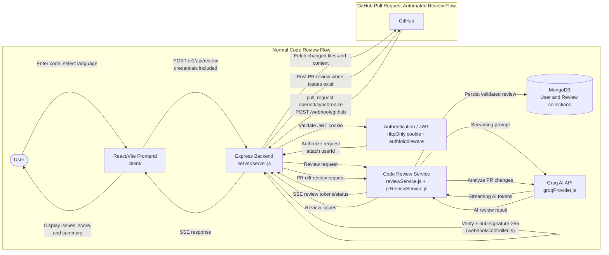
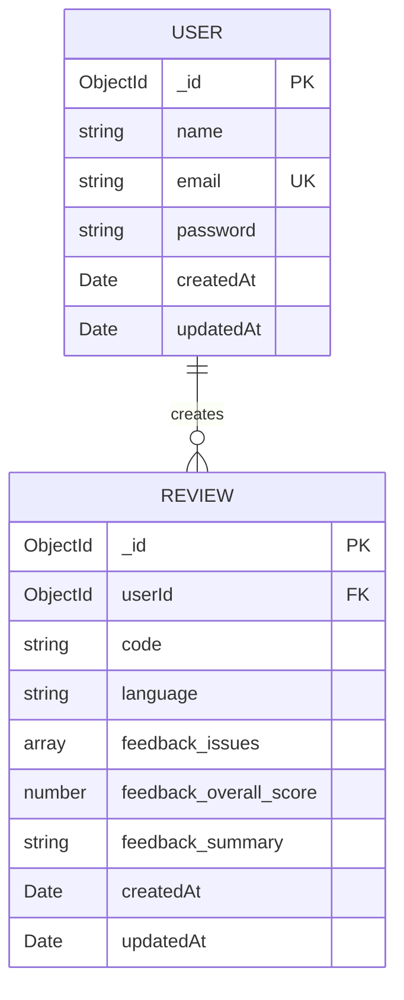
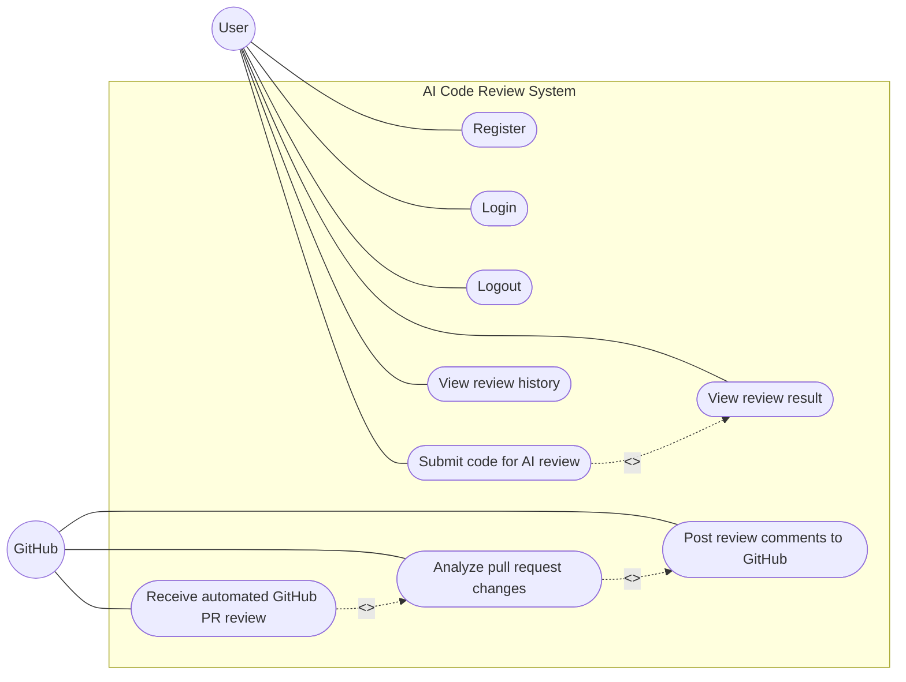
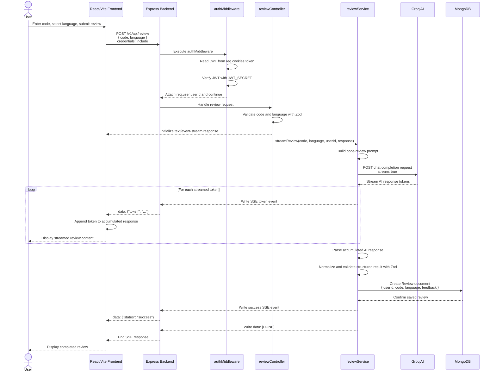
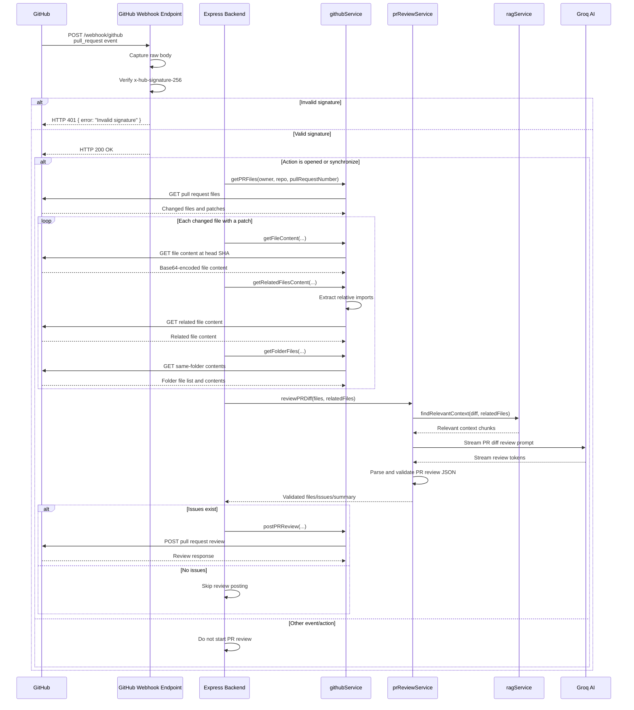
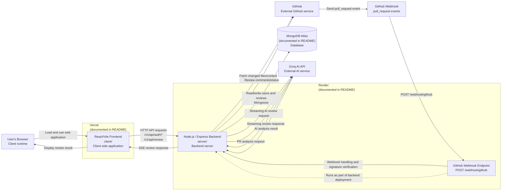

# Software Requirements Specification

## AI Code Review System

> **Implementation basis:** This SRS describes the code present in `mohdfaizan091/ai-code-review` at the repository’s `main` branch. Statements are classified as implemented, partially implemented, or future/proposed where appropriate. Deployment locations such as Vercel, Render, and MongoDB Atlas are documented in `README.md`; they are not independently verified by deployment configuration in the repository.

---

# 1. Introduction

## 1.1 Purpose

The AI Code Review System is a web application that allows an authenticated user to submit source code and receive an AI-generated review. The review is streamed to the browser and contains structured issues, an overall score, and a summary.

The backend also contains a GitHub webhook workflow that analyzes pull request changes and can post review comments back to GitHub.

## 1.2 Scope

### Implemented scope

The repository implements:

- React/Vite frontend application.
- User registration and login.
- JWT authentication using an HttpOnly cookie.
- Logout by clearing the authentication cookie.
- Protected code-review endpoints.
- Submission of code in five supported languages.
- Groq-based streaming AI review generation.
- SSE-style streaming from the backend to the frontend.
- Structured AI response parsing and Zod validation.
- Persistence of users and reviews in MongoDB through Mongoose.
- Paginated review-history retrieval.
- GitHub pull request webhook handling.
- GitHub pull request file/context retrieval.
- AI analysis of pull request diffs.
- Posting GitHub pull request review comments when issues are found.

### Partially implemented scope

The repository also contains:

- `ragService.js`
- `embeddingService.js`
- A user route named `getAllUsers`, whose implementation currently returns the literal text `"Alll Users"` rather than user records.
- A GitHub PR review workflow that is triggered asynchronously after returning `200 OK`; the webhook caller does not receive review progress or completion status.

### Not implemented

The repository does not implement:

- GitHub OAuth or GitHub login.
- Role-based authorization.
- Password reset or email verification.
- A documented administrative user-management interface.
- A separate deployment configuration for Vercel, Render, or MongoDB Atlas.
- A test suite; the backend `test` script exits with an error.

## 1.3 Intended Audience

This document is intended for:

- Developers maintaining the application.
- Reviewers evaluating the repository architecture.
- Students preparing a software engineering or college project report.
- Operators configuring the backend, database, Groq API, and GitHub webhook.
- Users seeking to understand the system’s supported workflows.

## 1.4 Definitions and Abbreviations

| Term | Definition |
| ---- | ---- |
| AI | Artificial Intelligence |
| API | Application Programming Interface |
| JWT | JSON Web Token |
| SSE | Server-Sent Events |
| PR | Pull Request |
| HMAC | Hash-based Message Authentication Code |
| UI | User Interface |
| REST | Representational State Transfer |
| LLM | Large Language Model |
| Mongoose | MongoDB object modeling library used by the backend |
| RAG | Retrieval-Augmented Generation; represented by repository services named `ragService.js` and `embeddingService.js` |

---

# 2. Overall Description

## 2.1 Product Perspective

The system is a full-stack web application divided into a React/Vite frontend and an Express backend.

The frontend:

- Provides authentication pages.
- Provides code editing and language selection.
- Submits code-review requests.
- Consumes streamed review responses.
- Displays review findings and history.

The backend:

- Exposes authentication, review, user, and webhook routes.
- Validates requests and authentication.
- Calls Groq for AI review generation.
- Validates AI output.
- Persists users and reviews in MongoDB.
- Integrates with GitHub for automated PR review.

The backend is organized broadly as:

```text
Routes
→ Controllers
→ Services
→ Providers / Models
```

Relevant top-level directories:

```text
client/
server/
```

## 2.2 Product Functions

### User registration

Implemented through:

```text
POST /v1/api/auth/register
```

The request requires `name`, `email`, and `password`. The password is hashed using bcrypt before persistence.

### User login/logout

Implemented through:

```text
POST /v1/api/auth/login
POST /v1/api/auth/logout
```

Login verifies the user’s password and issues a JWT in an HttpOnly cookie. Logout clears the cookie.

### JWT authentication

Protected routes use:

```text
server/src/middleware/authMiddleware.js
```

The middleware reads `req.cookies.token`, verifies it with `JWT_SECRET`, and attaches the decoded user identifier to `req.user`.

### Code submission

Authenticated users submit:

```text
code
language
```

to:

```text
POST /v1/api/review
```

Supported languages are:

- `javascript`
- `typescript`
- `python`
- `java`
- `cpp`

### AI-powered code review

`reviewService.js` builds a review prompt and invokes:

```text
server/src/providers/groqProvider.js
```

The provider calls the Groq chat-completion API with streaming enabled.

### Streaming review results

The backend sets the response content type to `text/event-stream` and emits token, status, and completion events.

The frontend reads the response body and processes the SSE-style data events in:

```text
client/src/services/reviewService.js
```

### Review history

Authenticated users can retrieve their own reviews through:

```text
GET /v1/api/review
```

The endpoint supports page and limit query parameters and excludes the stored `code` field from history results.

### GitHub pull request automated review

GitHub sends pull request webhooks to:

```text
POST /webhook/github
```

The handler processes `opened` and `synchronize` pull request actions, retrieves changed files and related repository files, analyzes the diff, and posts review comments when issues are found.

## 2.3 User Classes

### Registered application user

A user who registers and logs in through the application. This user can:

- Submit code for AI review.
- View streamed review results.
- View review history.
- Log out.

### Guest visitor

The README describes a guest mode and the frontend contains a landing page. However, authenticated review submission is enforced by the backend. The repository does not demonstrate a separate guest review API.

Therefore, guest mode is classified as **partially implemented or frontend-present**, not as an unauthenticated backend review capability.

### GitHub

GitHub acts as an external system rather than a normal application user. It:

- Sends pull request webhook events.
- Provides pull request files and repository content through its API.
- Receives review comments from the backend.

## 2.4 Operating Environment

### Frontend

Source:

```text
client/
```

Technology evidenced by the repository:

- React
- Vite
- JavaScript/JSX
- React Router, as documented in `README.md`
- Monaco Editor integration, as documented and represented by `CodeEditor.jsx`
- CSS styling

### Backend

Source:

```text
server
```

Technology:

- Node.js
- Express
- ES modules
- `cookie-parser`
- `cors`
- `dotenv`
- `jsonwebtoken`
- `bcrypt`
- `zod`
- `mongoose`

### Database

- MongoDB through Mongoose.
- The README documents MongoDB Atlas as the deployment database.
- The connection uses `MONGO_URI`.

### External services

- Groq API for AI review generation.
- GitHub API for pull request file access and posting reviews.
- GitHub webhook delivery for PR events.

## 2.5 Design and Implementation Constraints

The implementation imposes the following constraints:

1. Review requests require authentication through a JWT cookie.
2. Code review languages are restricted to five enumerated values.
3. The AI response must conform to the review Zod schema before being persisted.
4. The normal review response is streamed using `text/event-stream`.
5. JWT cookies are configured with `httpOnly`, `secure`, and `sameSite: "none"`.
6. The backend depends on environment variables validated in `envConfig.js`.
7. GitHub webhook processing depends on a valid `GITHUB_WEBHOOK_SECRET`.
8. GitHub API calls depend on `GITHUB_TOKEN`.
9. The GitHub webhook route requires access to the raw request body for HMAC verification.
10. The backend currently has no implemented automated test command.

## 2.6 Assumptions and Dependencies

The implementation depends on:

- A valid MongoDB connection string in `MONGO_URI`.
- A valid JWT secret in `JWT_SECRET`.
- A valid Groq key in `GROQ_API_KEY`.
- `GITHUB_WEBHOOK_SECRET` for webhook signature verification.
- `GITHUB_TOKEN` for GitHub API operations.
- Network access to Groq and GitHub.
- A browser capable of using cookies and reading streaming fetch responses.
- Correct cross-origin configuration between frontend and backend.

The exact GitHub webhook payload format is not defined by repository-specific schemas; the controller assumes GitHub’s standard payload structure.

---

# 3. Functional Requirements

## FR-01 — Register a user

- **Requirement:** The system shall allow a client to register a user with a name, email, and password.
- **Actor:** User.
- **Preconditions:** The backend is running and MongoDB is available.
- **Main flow:**
  1. Client sends `POST /v1/api/auth/register`.
  2. The controller validates the body with `registerSchema`.
  3. The controller checks whether the email already exists.
  4. The password is hashed with bcrypt.
  5. A `User` document is created.
- **Expected result:** The system returns HTTP 201 with a success message and the created user identifier.
- **Implementation:** `server/src/routes/authRoutes.js`, `server/src/controllers/authController.js`, `server/src/services/authService.js`, `server/src/models/User.js`.
- **Status:** Implemented.

## FR-02 — Reject invalid registration data

- **Requirement:** The system shall reject registration data when the name is empty, the email is invalid, or the password is shorter than six characters.
- **Actor:** User.
- **Preconditions:** A registration request is received.
- **Main flow:** The Zod registration schema parses the request body.
- **Expected result:** The system returns HTTP 400 with the validation error message.
- **Implementation:** `server/src/services/authService.js`, `server/src/controllers/authController.js`.
- **Status:** Implemented.

## FR-03 — Prevent duplicate email registration

- **Requirement:** The system shall reject registration when a user with the submitted email already exists.
- **Actor:** User.
- **Preconditions:** A user with the submitted email exists.
- **Main flow:** The controller queries `User.findOne({ email })`.
- **Expected result:** HTTP 409 with `"Email already exists"`.
- **Implementation:** `server/src/controllers/authController.js`, `server/src/models/User.js`.
- **Status:** Implemented.

## FR-04 — Authenticate a user

- **Requirement:** The system shall authenticate a user using email and password.
- **Actor:** User.
- **Preconditions:** The user exists and the login request includes email and password.
- **Main flow:**
  1. The controller finds the user by email.
  2. bcrypt compares the submitted password with the stored hash.
  3. A JWT is signed with `JWT_SECRET`.
  4. The JWT is stored in the `token` cookie.
- **Expected result:** HTTP 200 with a login success response and user identifier.
- **Implementation:** `server/src/controllers/authController.js`.
- **Status:** Implemented.

## FR-05 — Reject invalid login credentials

- **Requirement:** The system shall return an authentication error when the email does not exist or the password is incorrect.
- **Actor:** User.
- **Preconditions:** A login request is received.
- **Main flow:** The controller cannot find the user or bcrypt comparison returns false.
- **Expected result:** HTTP 401 with `"Invalid email or password"`.
- **Implementation:** `server/src/controllers/authController.js`.
- **Status:** Implemented.

## FR-06 — Retrieve authenticated user context

- **Requirement:** The system shall provide the user identifier extracted from a valid JWT.
- **Actor:** User.
- **Preconditions:** A valid `token` cookie is present.
- **Main flow:** `authMiddleware` verifies the JWT and `getMe` returns `req.user`.
- **Expected result:** HTTP 200 with `success: true` and the authenticated user object.
- **Implementation:** `server/src/routes/authRoutes.js`, `server/src/middleware/authMiddleware.js`, `server/src/controllers/authController.js`.
- **Status:** Implemented.

## FR-07 — Log out a user

- **Requirement:** The system shall clear the authentication cookie for an authenticated user.
- **Actor:** User.
- **Preconditions:** A valid JWT cookie is present.
- **Main flow:** The logout route executes `authMiddleware`, then clears the `token` cookie.
- **Expected result:** HTTP 200 with `"Logged out successfully"`.
- **Implementation:** `server/src/controllers/authController.js`.
- **Status:** Implemented.

## FR-08 — Authenticate protected requests

- **Requirement:** The system shall protect routes that use `authMiddleware`.
- **Actor:** User.
- **Preconditions:** A protected route is requested.
- **Main flow:**
  1. Read `req.cookies.token`.
  2. Reject the request if the cookie is absent.
  3. Verify the JWT with `JWT_SECRET`.
  4. Attach `userId` to `req.user`.
  5. Continue to the controller.
- **Expected result:** Valid requests proceed; missing, invalid, or expired tokens receive HTTP 401.
- **Implementation:** `server/src/middleware/authMiddleware.js`.
- **Status:** Implemented.

## FR-09 — Submit source code for review

- **Requirement:** An authenticated user shall be able to submit source code and a supported programming language.
- **Actor:** User.
- **Preconditions:** A valid JWT cookie exists; code is not empty; language is supported.
- **Main flow:**
  1. Frontend sends `POST /v1/api/review`.
  2. Backend authenticates the request.
  3. `reviewController` validates `code` and `language`.
  4. `reviewService` receives the request.
- **Expected result:** An SSE review stream is initiated.
- **Implementation:** `client/src/services/reviewService.js`, `server/src/routes/reviewRoutes.js`, `server/src/controllers/reviewController.js`.
- **Status:** Implemented.

## FR-10 — Generate an AI code review

- **Requirement:** The system shall send a code-review prompt to the Groq API.
- **Actor:** Authenticated User / Groq AI.
- **Preconditions:** A valid review request has passed authentication and validation.
- **Main flow:**
  1. `reviewService` builds the prompt.
  2. `groqProvider` sends a streaming chat-completion request.
  3. Groq returns streamed response chunks.
- **Expected result:** The backend receives AI review tokens.
- **Implementation:** `server/src/services/reviewService.js`, `server/src/providers/groqProvider.js`.
- **Status:** Implemented.

## FR-11 — Stream review results

- **Requirement:** The system shall stream AI response tokens to the frontend.
- **Actor:** User.
- **Preconditions:** Groq returns a streaming response.
- **Main flow:**
  1. Provider yields tokens.
  2. `reviewService` writes `data: {"token":"..."}` events.
  3. The frontend reads the stream and accumulates tokens.
- **Expected result:** The user can see review output while processing is in progress.
- **Implementation:** `server/src/services/reviewService.js`, `server/src/providers/groqProvider.js`, `client/src/services/reviewService.js`.
- **Status:** Implemented.

## FR-12 — Validate structured AI output

- **Requirement:** The system shall parse, normalize, and validate the final AI response before persistence.
- **Actor:** Backend.
- **Preconditions:** AI streaming has completed.
- **Main flow:**
  1. Extract JSON from the accumulated response.
  2. Repair or parse JSON.
  3. Normalize string issue formats when applicable.
  4. Validate with `reviewResponseSchema`.
- **Expected result:** Only a structurally valid review is persisted.
- **Implementation:** `server/src/services/reviewService.js`, `server/src/utils/aiResponseParser.js`.
- **Status:** Implemented.

## FR-13 — Persist a completed review

- **Requirement:** The system shall save a validated review with its user, code, language, and feedback.
- **Actor:** Backend.
- **Preconditions:** AI output has passed validation.
- **Main flow:** `Review.create()` creates a document.
- **Expected result:** A review is stored in MongoDB.
- **Implementation:** `server/src/services/reviewService.js`, `server/src/models/Review.js`, `server/src/config/db.js`.
- **Status:** Implemented.

## FR-14 — Retrieve review history

- **Requirement:** An authenticated user shall be able to retrieve their own prior reviews.
- **Actor:** User.
- **Preconditions:** A valid JWT cookie exists.
- **Main flow:**
  1. Backend obtains `req.user.userId`.
  2. Reviews are filtered by `userId`.
  3. Results are sorted newest first.
  4. Pagination is applied.
  5. The `code` field is excluded.
- **Expected result:** HTTP 200 with reviews and pagination metadata.
- **Implementation:** `server/src/controllers/reviewController.js`, `server/src/models/Review.js`, `client/src/pages/HistoryPage.jsx`.
- **Status:** Implemented.

## FR-15 — Receive GitHub pull request webhooks

- **Requirement:** The backend shall receive GitHub pull request webhook requests.
- **Actor:** GitHub.
- **Preconditions:** GitHub is configured to deliver webhooks to `/webhook/github`.
- **Main flow:**
  1. Raw request body is captured.
  2. Signature is verified.
  3. The event type and action are read.
- **Expected result:** Valid requests receive HTTP 200 `OK`.
- **Implementation:** `server/server.js`, `server/src/routes/webhookRoutes.js`, `server/src/controllers/webhookController.js`.
- **Status:** Implemented.

## FR-16 — Process selected pull request events

- **Requirement:** The system shall initiate automated review processing for `pull_request` events with `opened` or `synchronize` actions.
- **Actor:** GitHub.
- **Preconditions:** Webhook signature is valid and payload contains the expected repository and pull request properties.
- **Main flow:**
  1. Retrieve changed files.
  2. Retrieve changed-file contents.
  3. Retrieve related imported files and same-folder JavaScript files.
  4. Deduplicate related files.
  5. Analyze the pull request diff.
- **Expected result:** A structured PR review is generated asynchronously.
- **Implementation:** `server/src/controllers/webhookController.js`, `server/src/services/githubService.js`, `server/src/services/prReviewService.js`.
- **Status:** Implemented.

## FR-17 — Analyze pull request changes

- **Requirement:** The system shall analyze changed lines in pull request patches and return file-level issues and a summary.
- **Actor:** GitHub / Backend.
- **Preconditions:** Changed PR files and optional related context are available.
- **Main flow:**
  1. Build a diff prompt.
  2. Include changed patches and relevant context.
  3. Stream a response from Groq.
  4. Parse and validate the PR result.
- **Expected result:** A validated object containing files, issues, and a summary.
- **Implementation:** `server/src/services/prReviewService.js`, `server/src/services/ragService.js`, `server/src/providers/groqProvider.js`.
- **Status:** Implemented.

## FR-18 — Post GitHub review comments

- **Requirement:** The system shall post a GitHub review when the PR analysis identifies issues.
- **Actor:** GitHub / Backend.
- **Preconditions:** A valid PR review exists and at least one analyzed file contains an issue.
- **Main flow:**
  1. Convert issues into GitHub review comments.
  2. Set the comment path, line, side, and body.
  3. Submit the review with event `COMMENT`.
- **Expected result:** GitHub receives the review.
- **Implementation:** `server/src/controllers/webhookController.js`, `server/src/services/githubService.js`.
- **Status:** Implemented.

## FR-19 — Expose the users route

- **Requirement:** The system shall expose `GET /v1/api/users/`.
- **Actor:** Unauthenticated caller.
- **Preconditions:** Backend is running.
- **Main flow:** The route invokes `getAllUsers`.
- **Expected result:** The response body is the literal text `"Alll Users"`.
- **Implementation:** `server/src/routes/userRoutes.js`, `server/src/controllers/userController.js`.
- **Status:** Implemented as a placeholder; user retrieval is not implemented.

---

# 4. Non-Functional Requirements

The following requirements are limited to behavior evidenced by the code.

## NFR-01 — Password protection

- Passwords shall be hashed with bcrypt before being stored.
- **Evidence:** `server/src/controllers/authController.js`.

## NFR-02 — Cookie-based token protection

- JWTs shall be stored in an HttpOnly cookie.
- The configured cookie also uses `secure: true` and `sameSite: "none"`.
- **Evidence:** `server/src/controllers/authController.js`.

## NFR-03 — Protected resource access

- Routes using `authMiddleware` shall reject absent, invalid, or expired JWT cookies.
- **Evidence:** `server/src/middleware/authMiddleware.js`.

## NFR-04 — Webhook authenticity

- GitHub webhook requests shall be verified using HMAC SHA-256 and `GITHUB_WEBHOOK_SECRET`.
- **Evidence:** `server/src/controllers/webhookController.js`.

## NFR-05 — Structured AI output reliability

- AI results shall be extracted, repaired when possible, parsed, normalized, and validated before persistence.
- **Evidence:** `server/src/services/reviewService.js`, `server/src/utils/aiResponseParser.js`.

## NFR-06 — Incremental response delivery

- Normal code review results shall be delivered incrementally through an SSE-style response.
- **Evidence:** `server/src/controllers/reviewController.js`, `server/src/services/reviewService.js`.

## NFR-07 — Cross-origin credential support

- The backend shall allow configured frontend origins and credentials.
- **Evidence:** `server/server.js`.

## NFR-08 — Maintainable separation of concerns

- Routing, controllers, services, providers, models, middleware, and configuration are separated into distinct directories.
- **Evidence:** `server/src/routes`, `controllers`, `services`, `providers`, `models`, `middleware`, and `config`.

## NFR-09 — Paginated history retrieval

- Review history shall support page and limit parameters and return pagination metadata.
- This reduces the number of records returned per request but no numerical performance target is defined.
- **Evidence:** `server/src/controllers/reviewController.js`.

## NFR-10 — External provider abstraction

- Normal AI orchestration is separated from provider-specific Groq streaming code.
- **Evidence:** `reviewService.js` calls `streamCompletion` from `groqProvider.js`.

## NFR-11 — Configuration validation

- Required environment variables shall be checked using Zod during configuration loading.
- **Evidence:** `server/src/config/envConfig.js`.

## NFR-12 — Scalability characteristics

- The implementation has modular services and paginated history retrieval.
- No explicit horizontal-scaling, caching, queueing, rate-limiting, or numerical scalability requirements are implemented.
- **Status:** Partially supported at an architectural level; operational scalability is not specified.

---

# 5. System Architecture

## 5.1 Architecture Components

### React/Vite frontend

Located in:

```text
client/
```

Important paths:

- `client/src/main.jsx`
- `client/src/App.jsx`
- `client/src/pages`
- `client/src/components`
- `client/src/services`
- `client/src/context`

### Express backend

Entry point:

```text
server/server.js
```

The server:

- Connects to MongoDB.
- Captures GitHub webhook raw bodies.
- Configures JSON parsing, cookies, and CORS.
- Mounts route groups.

### Route → Controller → Service architecture

```text
server/src/routes
→ server/src/controllers
→ server/src/services
→ server/src/providers / server/src/models
```

### MongoDB/Mongoose

- Connection: `server/src/config/db.js`
- Models:
  - `server/src/models/User.js`
  - `server/src/models/Review.js`

### Groq AI

- Provider: `server/src/providers/groqProvider.js`
- Normal review orchestration: `server/src/services/reviewService.js`
- PR review orchestration: `server/src/services/prReviewService.js`

### GitHub integration

- Webhook route: `server/src/routes/webhookRoutes.js`
- Webhook controller: `server/src/controllers/webhookController.js`
- GitHub API service: `server/src/services/githubService.js`

## 5.2 Architecture Diagram



> **Note:** The GitHub webhook endpoint (`POST /webhook/github`) is a route handled inside the Express backend (`webhookController.js`), not a separate deployed component. It is shown here as part of `Backend` — consistent with the detailed call sequence in Section 11.2, where `Backend` (not a standalone "Webhook" actor) orchestrates calls to `githubService.js` and `prReviewService.js`.

---

# 6. Database Requirements

## 6.1 Database Technology

The backend uses MongoDB through Mongoose.

Connection:

```text
server/src/config/db.js
```

The connection string is read from:

```text
MONGO_URI
```

## 6.2 User Model

Source:

```text
server/src/models/User.js
```

| Field | Type | Required | Constraints / Meaning |
| ---- | ---- | ---- | ---- |
| `_id` | Mongoose ObjectId | Generated | Mongoose document identifier |
| `name` | String | Yes | User name |
| `email` | String | Yes | Unique email |
| `password` | String | Yes | Stored password hash |
| `createdAt` | Date | Generated | Enabled through timestamps |
| `updatedAt` | Date | Generated | Enabled through timestamps |

## 6.3 Review Model

Source:

```text
server/src/models/Review.js
```

| Field | Type | Required | Constraints / Meaning |
| ---- | ---- | ---- | ---- |
| `_id` | Mongoose ObjectId | Generated | Mongoose document identifier |
| `userId` | ObjectId | Yes | Reference to `User` |
| `code` | String | Yes | Submitted source code |
| `language` | String | Yes | Submitted language |
| `feedback.issues` | Array | Not explicitly marked required | Review issues; each item includes `line`, `severity`, `message`, and `fix` |
| `feedback.overall_score` | Number | Not explicitly marked required | AI review score |
| `feedback.summary` | String | Not explicitly marked required | AI review summary |
| `createdAt` | Date | Generated | Enabled through timestamps |
| `updatedAt` | Date | Generated | Enabled through timestamps |

> **Note:** `feedback` previously included a separate `suggestions` array. That was consolidated so each issue carries its own `fix` field, and the standalone `suggestions` array was removed. Confirm this table matches the current `Review.js` schema before finalizing.

## 6.4 Relationship

Each review contains a required reference to one user:

```javascript
userId: {
    type: mongoose.Schema.Types.ObjectId,
    ref: "User",
    required: true
}
```

Relationship:

- One `User` can have zero or more `Review` documents.
- Each `Review` references one `User`.

## 6.5 Data Persistence Behavior

- Registration creates a user document after bcrypt hashing.
- A completed and validated normal review creates a review document.
- Review history queries only the authenticated user’s reviews.
- Review history excludes the stored source-code field from the response.
- The GitHub PR workflow does not create a `Review` document through the visible webhook/controller flow.

## 6.6 ER Diagram



---

# 7. API Requirements

## 7.1 API Base Structure

The route mounting is defined in:

```text
server/server.js
```

| Route group | Base path |
| ---- | ---- |
| Authentication | `/v1/api/auth` |
| Reviews | `/v1/api/review` |
| Users | `/v1/api/users` |
| GitHub Webhook | `/webhook` |

## 7.2 Authentication Endpoints

| Method | Endpoint | Auth | Response |
| ---- | ---- | ---- | ---- |
| POST | `/v1/api/auth/register` | **No** | JSON |
| POST | `/v1/api/auth/login` | **No** | JSON and JWT cookie |
| GET | `/v1/api/auth/me` | **Yes** | JSON |
| POST | `/v1/api/auth/logout` | **Yes** | JSON and cleared cookie |

## 7.3 Review Endpoints

| Method | Endpoint | Auth | Response |
| ---- | ---- | ---- | ---- |
| POST | `/v1/api/review` | **Yes** | SSE |
| GET | `/v1/api/review` | **Yes** | JSON with pagination |

## 7.4 User Endpoint

| Method | Endpoint | Auth | Response |
| ---- | ---- | ---- | ---- |
| GET | `/v1/api/users/` | **No** | Plain text `"Alll Users"` |

This endpoint is implemented as a placeholder and does not return database users.

## 7.5 GitHub Webhook Endpoint

| Method | Endpoint | Authentication mechanism | Response |
| ---- | ---- | ---- | ---- |
| POST | `/webhook/github` | HMAC SHA-256 signature | Plain text `OK` |

The endpoint processes only pull request events with actions `opened` and `synchronize`.

Detailed request fields, responses, validation, and errors are defined by:

```text
server/src/routes
server/src/controllers
server/src/middleware
server/src/services
```

---

# 8. External Interface Requirements

## 8.1 Browser and Frontend Interface

The browser interacts with the React/Vite application in `client/`.

Frontend services include:

```text
client/src/services/authService.js
client/src/services/reviewService.js
```

The frontend sends credentials with authenticated requests:

```javascript
credentials: "include"
```

The normal review endpoint returns a streaming response consumed using `ReadableStream.getReader()`.

## 8.2 Groq API Interface

Source:

```text
server/src/providers/groqProvider.js
```

The provider sends:

```text
POST https://api.groq.com/openai/v1/chat/completions
```

Request characteristics implemented in the repository:

- Bearer authentication using `GROQ_API_KEY`.
- JSON request body.
- `stream: true`.
- `temperature: 0.2`.
- `max_tokens: 4096`.
- Model configured in source as `openai/gpt-oss-20b`.

The provider reads SSE-like response lines and yields content tokens.

## 8.3 MongoDB Interface

Source:

```text
server/src/config/db.js
```

Mongoose connects using `MONGO_URI`.

Models:

```text
server/src/models/User.js
server/src/models/Review.js
```

## 8.4 GitHub API Interface

Source:

```text
server/src/services/githubService.js
```

The service uses GitHub API requests to:

- Retrieve pull request files.
- Retrieve repository file content.
- Retrieve same-folder files.
- Post pull request reviews.

Authentication uses:

```text
GITHUB_TOKEN
```

with an API token header.

## 8.5 GitHub Webhook Interface

Source:

```text
server/src/controllers/webhookController.js
```

The webhook interface expects:

- `x-hub-signature-256`
- `x-github-event`
- Raw request body
- GitHub pull request payload fields

The server captures the raw body before normal JSON processing in `server/server.js`.

---

# 9. Security Requirements

## 9.1 JWT authentication

The backend signs JWTs with:

```text
JWT_SECRET
```

The token contains:

```javascript
{
  userId: user._id
}
```

and expires after seven days.

**Evidence:** `server/src/controllers/authController.js`.

## 9.2 HttpOnly cookies

The JWT is stored in a cookie configured with:

- `httpOnly: true`
- `secure: true`
- `sameSite: "none"`

This prevents normal client-side JavaScript access to the cookie.

**Evidence:** `server/src/controllers/authController.js`.

## 9.3 JWT middleware

Protected routes use `authMiddleware`.

**Evidence:** `server/src/middleware/authMiddleware.js`.

The middleware:

- Reads `req.cookies.token`.
- Rejects missing tokens.
- Verifies the token.
- Rejects invalid or expired tokens.
- Attaches the user identifier to the request.

## 9.4 Password hashing

Registration hashes passwords using bcrypt with a cost factor of `10`.

**Evidence:** `server/src/controllers/authController.js`.

## 9.5 GitHub webhook HMAC verification

The webhook controller calculates an HMAC SHA-256 digest from:

- `GITHUB_WEBHOOK_SECRET`
- `req.rawBody`

It compares the result using `crypto.timingSafeEqual`.

**Evidence:** `server/src/controllers/webhookController.js`.

## 9.6 GitHub API token

GitHub API requests use:

```text
GITHUB_TOKEN
```

The token is sent to GitHub API calls in `githubService.js`.

## 9.7 Validation

The repository uses Zod for:

- Environment validation.
- Registration validation.
- Normal review request validation.
- Normal AI response validation.
- PR AI response validation.

No additional authorization roles or permission levels are implemented.

---

# 10. Use Cases

## 10.1 Implemented Use Cases

- Register.
- Login.
- Logout.
- Submit code for AI review.
- View streamed review result.
- View review history.
- Receive automated GitHub PR review.
- Analyze pull request changes.
- Post review comments to GitHub.

## 10.2 Actors

- **User:** Uses the frontend and authenticated application functions.
- **GitHub:** Sends webhook events and receives automated review comments.

GitHub OAuth/login is not an implemented use case.

## 10.3 Use Case Diagram



---

# 11. Sequence Diagrams

## 11.1 Normal Code Review Sequence



## 11.2 GitHub PR Automated Review Sequence



> The webhook controller sends `200 OK` before asynchronous PR processing begins. The sequence after that response represents backend processing that continues independently. Note that `Webhook` here represents the request-handling stage inside `webhookController.js`; the orchestration calls to `GithubService` and `PRService` are made by the same backend process (`Backend`), not by a separately running component — this sequence is the authoritative version referenced by Section 5.2's architecture diagram.

---

# 12. Deployment Architecture

## 12.1 Deployment Information

The README documents the following deployment arrangement:

| System | Documented deployment |
| ---- | ---- |
| Frontend | Vercel |
| Backend | Render |
| Database | MongoDB Atlas |
| AI service | Groq API |
| Git hosting/webhooks | GitHub |

The repository does not contain enough deployment configuration to independently verify the Vercel or Render deployments. These locations are therefore marked **documented in README**.

## 12.2 Deployment Diagram



## 12.3 Normal Deployment Flow

1. Browser loads the frontend from the documented Vercel deployment.
2. Frontend sends API requests to the documented Render backend.
3. Backend authenticates users using JWT cookies.
4. Backend reads and writes MongoDB Atlas data.
5. Backend sends AI requests to Groq.
6. Backend streams review results to the frontend.

## 12.4 GitHub Deployment Flow

1. GitHub sends a pull request event to the Render-hosted webhook endpoint.
2. The backend verifies the signature.
3. The backend calls GitHub APIs for repository context.
4. The backend calls Groq for PR analysis.
5. The backend posts comments back to GitHub.

---

# 13. Error Handling

## 13.1 Authentication failures

Handled by:

```text
server/src/middleware/authMiddleware.js
```

### Missing cookie

Returns HTTP 401:

```json
{
  "success": false,
  "message": "Acess denied. No token is provided."
}
```

### Invalid or expired JWT

Returns HTTP 401:

```json
{
  "success": false,
  "message": "Invalid or expired token."
}
```

## 13.2 Invalid requests

### Registration

The registration schema can produce HTTP 400 responses for:

- Missing/empty name.
- Invalid email.
- Password shorter than six characters.

### Review submission

The review schema can produce HTTP 400 responses for:

- Empty code.
- Unsupported language.
- Missing required fields.

The exact Zod error message is returned as `message`.

## 13.3 AI failures

The Groq provider throws an error when:

- Groq returns a non-success HTTP status.
- The response body is missing.
- The streaming response contains a provider error.

`reviewService.js` sends an SSE error event containing the error message or a fallback message.

## 13.4 AI response validation failures

The system can reject an AI response when:

- No JSON object can be found.
- JSON parsing or repair fails.
- The structure does not match `reviewResponseSchema`.
- Issue severity is not `high`, `medium`, or `low`.
- The score is outside the range 0–10.
- Required fields are absent or have the wrong type.

The stream emits:

```text
data: {"status":"error","message":"AI response could not be validated. Please try again."}
```

## 13.5 Truncated AI responses

If the accumulated response does not end with `}`, the service emits:

```text
data: {"status":"error","message":"AI response was truncated. Please try again with shorter code."}
```

## 13.6 Database failures

- Database connection failure is logged by `db.js`, and the process exits with status behavior controlled by `process.exit(1)`.
- Review-history errors return HTTP 500 with the error message.
- Registration and login catch errors and return HTTP 400 with the error message.

## 13.7 GitHub webhook signature failures

If the signature is missing or does not match, the webhook controller returns HTTP 401:

```json
{
  "error": "Invalid signature"
}
```

## 13.8 GitHub API failures

`githubService.js` throws errors when GitHub API requests fail.

For asynchronous webhook processing, the controller logs:

```text
Failed to review/post PR: <error message>
```

Since `200 OK` is sent before background processing, the webhook sender does not receive a later processing failure response.

---

# 14. Limitations

The following limitations are visible in the repository.

## 14.1 No GitHub OAuth/login

The repository integrates with GitHub APIs and webhooks but does not implement GitHub authentication or OAuth.

## 14.2 User endpoint is a placeholder

`GET /v1/api/users/` does not query or return users. It returns:

```text
Alll Users
```

**Evidence:** `server/src/controllers/userController.js`.

## 14.3 Supported languages are restricted

Normal review submission accepts only:

- JavaScript
- TypeScript
- Python
- Java
- C++

**Evidence:** `server/src/controllers/reviewController.js`.

## 14.4 Review history excludes source code

The history endpoint explicitly selects `-code`, so stored source code is not returned by the history API.

## 14.5 GitHub webhook processing is asynchronous after acknowledgment

The webhook sends `200 OK` before the PR review is completed. The caller does not receive processing progress or final completion status.

## 14.6 GitHub PR processing requires specific payload fields

The webhook controller assumes fields such as:

- `repository.owner.login`
- `repository.name`
- `pull_request.number`
- `pull_request.head.sha`

No repository-specific schema validates the complete payload.

## 14.7 AI validation is strict

A malformed or structurally incompatible AI response is rejected and is not persisted as a normal review.

## 14.8 No explicit rate limiting

No rate-limiting middleware is visible in the repository.

## 14.9 No explicit role-based authorization

All authenticated users use the same authorization model. No roles or permissions are defined.

## 14.10 No implemented test suite

The backend package defines:

```json
"test": "echo \"Error: no test specified\" && exit 1"
```

## 14.11 Deployment configuration is not contained in the inspected source

Vercel, Render, and MongoDB Atlas are documented in `README.md`, but repository deployment manifests were not identified as implementation evidence.

## 14.12 Additional AI services are not fully integrated in the normal review path

`ragService.js` and `embeddingService.js` exist, but the normal review flow uses `reviewService.js` and `groqProvider.js`. `ragService.js` is used by `prReviewService.js`; the direct role of `embeddingService.js` in the inspected request path is not specified.

---

# 15. Future Enhancements

The following are **FUTURE / NOT CURRENTLY IMPLEMENTED** proposals. They are not requirements currently satisfied by the repository.

## FE-01 — GitHub OAuth

Add GitHub OAuth so users can connect their GitHub accounts through the application.

## FE-02 — Complete user management

Replace the placeholder users endpoint with authenticated, authorized user management and return actual user records.

## FE-03 — Role-based authorization

Add roles and permissions for regular users, administrators, and GitHub integration administrators.

## FE-04 — Review configuration

Allow users to configure review rules, severity thresholds, prompt settings, or repository-specific conventions.

## FE-05 — Review detail retrieval

Add an endpoint for retrieving the complete source code and feedback for one specific review.

## FE-06 — Improved webhook job tracking

Use a queue or persistent job record to track webhook processing, review status, retries, and failures.

## FE-07 — More robust webhook validation

Add schema validation for GitHub webhook payloads and idempotency handling for repeated webhook deliveries.

## FE-08 — Automated testing

Add unit, integration, API, frontend, and webhook signature tests.

## FE-09 — Operational protections

Consider rate limiting, structured logging, monitoring, retry handling, and secrets-management improvements.

## FE-10 — Broader language support

Extend the language validation list and add language-specific review prompting where appropriate.

## FE-11 — Complete retrieval/embedding pipeline

Clarify and integrate the roles of `ragService.js` and `embeddingService.js` if repository-context retrieval is intended to become a broader product feature.

---

# 16. Traceability

| Requirement ID | Requirement | Implementation/File | API/Component |
| ---- | ---- | ---- | ---- |
| FR-01 | Register a user | `server/src/controllers/authController.js`, `server/src/services/authService.js`, `server/src/models/User.js` | `POST /v1/api/auth/register` |
| FR-02 | Validate registration data | `server/src/services/authService.js` | Registration API |
| FR-03 | Reject duplicate email | `server/src/controllers/authController.js` | Registration API |
| FR-04 | Authenticate user and issue JWT | `server/src/controllers/authController.js` | `POST /v1/api/auth/login` |
| FR-05 | Reject invalid credentials | `server/src/controllers/authController.js` | Login API |
| FR-06 | Return authenticated user context | `server/src/middleware/authMiddleware.js`, `authController.js` | `GET /v1/api/auth/me` |
| FR-07 | Clear authentication cookie | `server/src/controllers/authController.js` | `POST /v1/api/auth/logout` |
| FR-08 | Protect authenticated routes | `server/src/middleware/authMiddleware.js` | Review/auth protected routes |
| FR-09 | Submit code for review | `client/src/services/reviewService.js`, `server/src/controllers/reviewController.js` | `POST /v1/api/review` |
| FR-10 | Generate AI review | `server/src/services/reviewService.js`, `server/src/providers/groqProvider.js` | Groq integration |
| FR-11 | Stream review results | `server/src/services/reviewService.js`, `client/src/services/reviewService.js` | Review SSE |
| FR-12 | Validate AI result | `server/src/services/reviewService.js`, `server/src/utils/aiResponseParser.js` | Review processing |
| FR-13 | Persist completed review | `server/src/services/reviewService.js`, `server/src/models/Review.js` | MongoDB |
| FR-14 | Retrieve review history | `server/src/controllers/reviewController.js`, `client/src/pages/HistoryPage.jsx` | `GET /v1/api/review` |
| FR-15 | Receive GitHub webhooks | `server/server.js`, `server/src/routes/webhookRoutes.js`, `webhookController.js` | `POST /webhook/github` |
| FR-16 | Process PR opened/synchronized events | `server/src/controllers/webhookController.js` | GitHub webhook flow |
| FR-17 | Analyze PR changes | `server/src/services/prReviewService.js`, `server/src/services/ragService.js` | PR review flow |
| FR-18 | Post GitHub review comments | `server/src/services/githubService.js` | GitHub API |
| FR-19 | Expose users route | `server/src/routes/userRoutes.js`, `server/src/controllers/userController.js` | `GET /v1/api/users/` |
| NFR-01 | Hash passwords | `server/src/controllers/authController.js` | Authentication |
| NFR-02 | Use HttpOnly JWT cookie | `server/src/controllers/authController.js` | Authentication |
| NFR-03 | Reject invalid JWTs | `server/src/middleware/authMiddleware.js` | Protected routes |
| NFR-04 | Verify webhook HMAC | `server/src/controllers/webhookController.js` | GitHub webhook |
| NFR-05 | Validate AI structure | `server/src/services/reviewService.js` | AI review |
| NFR-06 | Deliver incremental results | `server/src/services/reviewService.js`, `groqProvider.js` | SSE review |
| NFR-07 | Support configured CORS credentials | `server/server.js` | Frontend/backend interface |
| NFR-08 | Separate architectural layers | `server/src/routes`, `controllers`, `services`, `providers`, `models` | Backend architecture |
| NFR-09 | Paginate review history | `server/src/controllers/reviewController.js` | `GET /v1/api/review` |
| NFR-10 | Abstract AI provider call | `reviewService.js`, `groqProvider.js` | AI integration |
| NFR-11 | Validate environment configuration | `server/src/config/envConfig.js` | Backend startup |

---

## Implementation Status Summary

| Area | Status |
| ---- | ---- |
| React/Vite frontend | Implemented |
| Registration | Implemented |
| Login and logout | Implemented |
| JWT cookie authentication | Implemented |
| Protected review submission | Implemented |
| Groq streaming review | Implemented |
| Structured AI response validation | Implemented |
| MongoDB user/review persistence | Implemented |
| Review history pagination | Implemented |
| GitHub webhook signature validation | Implemented |
| GitHub PR file retrieval | Implemented |
| Automated PR review generation | Implemented |
| GitHub review comment posting | Implemented |
| User listing | Partially implemented; placeholder response only |
| Guest review mode | Frontend/README indication exists, but unauthenticated backend review is not implemented |
| GitHub OAuth | Not implemented |
| Role-based authorization | Not implemented |
| Automated test suite | Not implemented |
| Vercel/Render deployment | Documented in README, not independently confirmed by source deployment configuration |