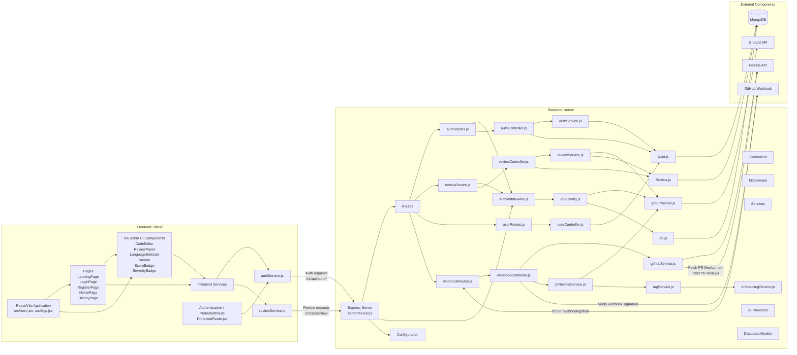

# AI Code Review System — Component Diagram

## 1. Overview

The AI Code Review System is divided into frontend, backend, and external components.

The frontend is implemented using React/Vite, while the backend uses Node.js and Express. The backend follows the implemented Route → Controller → Service architecture and communicates with external services such as Groq AI, MongoDB, and GitHub.

## 2. Component Diagram



## 3. Component Relationships

### Frontend

- The React/Vite application is bootstrapped by `client/src/main.jsx` and `client/src/App.jsx`.
- `Pages` contains the application screens in `client/src/pages`.
- Reusable UI components are located under `client/src/components`.
- `client/src/services/authService.js` communicates with authentication endpoints.
- `client/src/services/reviewService.js` sends review requests and consumes the streamed review response.
- `ProtectedRoute.jsx` uses the authentication service to restrict authenticated frontend routes.

### Backend Request Architecture

The backend follows the repository's implemented layering:

```text
Routes → Controllers → Services → Providers / Models
```

- Routes: `server/src/routes`
- Controllers: `server/src/controllers`
- Authentication checks: `server/src/middleware/authMiddleware.js`
- Business logic: `server/src/services`
- AI provider integration: `server/src/providers/groqProvider.js`
- MongoDB persistence: `server/src/models/User.js`, `server/src/models/Review.js`

### AI and Review Processing

- `reviewService.js` builds and streams normal code reviews, then persists validated results through `Review.js`.
- `groqProvider.js` calls the external Groq AI API and is shared by both review paths.
- `prReviewService.js` supports the pull-request review path used by the GitHub webhook controller.
- `ragService.js` retrieves relevant repository context (via `embeddingService.js`) so `prReviewService.js` can flag duplicate or inconsistent code during PR review.

### Database and Configuration

- `User.js` and `Review.js` are Mongoose models backed by MongoDB.
- `db.js` establishes the MongoDB connection.
- `envConfig.js` validates required environment variables, including database, JWT, and Groq configuration.

### GitHub Integration

- GitHub sends pull-request events to `POST /webhook/github`.
- `webhookRoutes.js` routes the event to `webhookController.js`.
- The controller verifies the webhook signature, obtains pull-request information, and coordinates the GitHub and PR review services.
- `githubService.js` communicates with the GitHub API to retrieve pull-request context and post review results back to GitHub.

## 4. Component Responsibilities

| Component | Responsibility |
|---|---|
| React/Vite Application | Frontend application entry and routing |
| Pages | Application screens |
| UI Components | Reusable user-interface elements |
| `authService.js` (frontend) | Frontend authentication API communication |
| `reviewService.js` (frontend) | Frontend review API communication and streamed response handling |
| Express Server | Backend HTTP server |
| Routes | Define API endpoints |
| Controllers | Handle HTTP requests and coordinate application logic |
| `authMiddleware.js` | JWT authentication and authorization |
| `authService.js` (backend) | Authentication business logic |
| `reviewService.js` (backend) | Normal AI code-review processing |
| `githubService.js` | GitHub API operations (fetch PR files, post reviews) |
| `prReviewService.js` | Pull-request diff review processing |
| `ragService.js` | Retrieves relevant repo context via embeddings for PR review |
| `embeddingService.js` | Generates text embeddings used by `ragService.js` |
| `groqProvider.js` | Groq AI API integration |
| `User.js` | User MongoDB model |
| `Review.js` | Review MongoDB model |
| `db.js` | MongoDB connection |
| `envConfig.js` | Environment configuration |
| GitHub Webhook | Sends pull-request events |
| GitHub API | Provides repository/PR data and receives review results |
| Groq AI | Performs AI-powered code analysis |
| MongoDB | Persists application data |

## 5. Architectural Pattern

The backend follows a layered architecture — HTTP routing, authentication, business logic, external API communication, and database persistence are kept in separate components:

```text
HTTP Request → Routes → Middleware → Controllers → Services → Providers / Models → Groq API / MongoDB
```

This structure supports both system workflows — normal AI code review (Frontend → Express → Auth Middleware → Review Controller → Review Service → Groq AI → MongoDB) and automated GitHub PR review (GitHub Webhook → Webhook Route/Controller → GitHub Service + PR Review Service → Groq AI → GitHub API) — through the same layered backend.