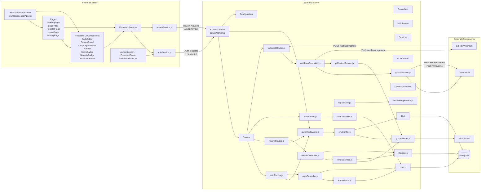

# AI Code Review System — Component Diagram

## 1. Overview

The AI Code Review System is divided into frontend, backend, and external components.

The frontend is implemented using React/Vite, while the backend uses Node.js and Express. The backend follows the implemented Route → Controller → Service architecture and communicates with external services such as Groq AI, MongoDB, and GitHub.

## 2. Component Diagram



## 3. Component Relationships

### Frontend

- The React/Vite application is bootstrapped by `client--/src/main.jsx` and `client--/src/App.jsx`.
- `Pages` contains the application screens in `client--/src/pages`.
- Reusable UI components are located under `client--/src/components`.
- `client--/src/services/authService.js` communicates with authentication endpoints.
- `client--/src/services/reviewService.js` sends review requests and consumes the streamed review response.
- `ProtectedRoute.jsx` uses the authentication service to restrict authenticated frontend routes.

### Backend Request Architecture

The backend follows the repository's implemented:

```text
Routes
   ↓
Controllers
   ↓
Services
   ↓
Providers / Models
```

Routes are defined under:

```text
server/src/routes
```

Controllers are defined under:

```text
server/src/controllers
```

Authentication checks are performed by:

```text
server/src/middleware/authMiddleware.js
```

Business logic is organized under:

```text
server/src/services
```

AI provider integration is implemented in:

```text
server/src/providers/groqProvider.js
```

MongoDB persistence is represented by:

```text
server/src/models/User.js
server/src/models/Review.js
```

### AI and Review Processing

- `reviewService.js` builds and streams normal code reviews.
- `groqProvider.js` calls the external Groq AI API.
- `reviewService.js` persists validated review results through `Review.js`.
- `prReviewService.js` supports the pull-request review path used by the GitHub webhook controller.
- `ragService.js` and `embeddingService.js` exist as backend service components in `server/src/services`.

### Database and Configuration

- `User.js` and `Review.js` are Mongoose models backed by MongoDB.
- `db.js` establishes the MongoDB connection.
- `envConfig.js` validates required environment variables, including database, JWT, and Groq configuration.

### GitHub Integration

- GitHub sends pull-request events to `POST /webhook/github`.
- `webhookRoutes.js` routes the event to `webhookController.js`.
- The controller verifies the webhook signature, obtains pull-request information, and coordinates GitHub and PR review services.
- `githubService.js` communicates with the GitHub API to retrieve pull-request context and post review results back to GitHub.

## 4. Frontend Component Structure

The frontend can be summarized as:

```text
React/Vite Application
        │
        ├── Pages
        │     ├── LandingPage
        │     ├── LoginPage
        │     ├── RegisterPage
        │     ├── HomePage
        │     └── HistoryPage
        │
        ├── UI Components
        │     ├── CodeEditor
        │     ├── ReviewPanel
        │     ├── LanguageSelector
        │     ├── Navbar
        │     ├── ScoreBadge
        │     ├── SeverityBadge
        │     └── ProtectedRoute
        │
        └── Services
              ├── authService.js
              └── reviewService.js
```

## 5. Backend Component Structure

The backend can be summarized as:

```text
Express Server
      │
      ├── Routes
      │     ├── authRoutes.js
      │     ├── reviewRoutes.js
      │     ├── userRoutes.js
      │     └── webhookRoutes.js
      │
      ├── Middleware
      │     └── authMiddleware.js
      │
      ├── Controllers
      │     ├── authController.js
      │     ├── reviewController.js
      │     ├── userController.js
      │     └── webhookController.js
      │
      ├── Services
      │     ├── authService.js
      │     ├── reviewService.js
      │     ├── githubService.js
      │     ├── prReviewService.js
      │     ├── ragService.js
      │     └── embeddingService.js
      │
      ├── Providers
      │     └── groqProvider.js
      │
      ├── Models
      │     ├── User.js
      │     └── Review.js
      │
      └── Configuration
            ├── envConfig.js
            └── db.js
```

## 6. External Component Relationships

The backend communicates with three primary external systems:

```text
                    ┌──────────────┐
                    │   Groq AI    │
                    └──────▲───────┘
                           │
                    groqProvider.js
                           │
                           │
┌──────────────┐     ┌────┴─────────┐     ┌──────────────┐
│   MongoDB    │◄────│   Backend    │────►│    GitHub    │
└──────────────┘     └──────────────┘     └──────────────┘
                           ▲
                           │
                           │ webhook
                           │
                    ┌──────┴───────┐
                    │GitHub Webhook│
                    └──────────────┘
```

## 7. Authentication Component Interaction

The authentication components interact as follows:

```text
Frontend
   │
   │ Auth Request
   ▼
Express Server
   │
   ▼
Auth Routes
   │
   ▼
Auth Controller
   │
   ▼
Auth Service
   │
   ▼
User Model
   │
   ▼
MongoDB
```

Protected requests additionally pass through:

```text
AuthMiddleware
```

which verifies the JWT before allowing access to protected controllers.

## 8. Code Review Component Interaction

The normal code-review path is:

```text
React Frontend
      │
      ▼
reviewService.js
      │
      ▼
Express Backend
      │
      ▼
reviewController.js
      │
      ▼
reviewService.js
      │
      ▼
groqProvider.js
      │
      ▼
Groq AI
      │
      ▼
Review Result
      │
      ├──────────────► Frontend through SSE
      │
      └──────────────► Review.js
                              │
                              ▼
                           MongoDB
```

## 9. GitHub PR Review Component Interaction

The automated pull-request review path is:

```text
GitHub
   │
   ▼
GitHub Webhook
   │
   ▼
webhookRoutes.js
   │
   ▼
webhookController.js
   │
   ├──────────────► githubService.js
   │                      │
   │                      ▼
   │                  GitHub API
   │
   └──────────────► prReviewService.js
                          │
                          ▼
                    groqProvider.js
                          │
                          ▼
                       Groq AI
                          │
                          ▼
                    Review Result
                          │
                          ▼
                    githubService.js
                          │
                          ▼
                       GitHub
```

## 10. Component Responsibilities

| Component | Responsibility |
|---|---|
| React/Vite Application | Frontend application entry and routing |
| Pages | Application screens |
| UI Components | Reusable user-interface elements |
| `authService.js` | Frontend authentication API communication |
| `reviewService.js` | Frontend review API communication and streamed response handling |
| Express Server | Backend HTTP server |
| Routes | Define API endpoints |
| Controllers | Handle HTTP requests and coordinate application logic |
| `authMiddleware.js` | JWT authentication and authorization |
| `authService.js` | Authentication business logic |
| `reviewService.js` | Normal AI code-review processing |
| `githubService.js` | GitHub API operations |
| `prReviewService.js` | Pull-request review processing |
| `ragService.js` | RAG-related service functionality |
| `embeddingService.js` | Embedding-related functionality |
| `groqProvider.js` | Groq AI API integration |
| `User.js` | User MongoDB model |
| `Review.js` | Review MongoDB model |
| `db.js` | MongoDB connection |
| `envConfig.js` | Environment configuration |
| GitHub Webhook | Sends pull-request events |
| GitHub API | Provides repository/PR data and receives review results |
| Groq AI | Performs AI-powered code analysis |
| MongoDB | Persists application data |

## 11. Architectural Pattern

The backend primarily follows a layered architecture:

```text
                 HTTP Request
                      │
                      ▼
                   Routes
                      │
                      ▼
                 Middleware
                      │
                      ▼
                 Controllers
                      │
                      ▼
                   Services
                  /        \
                 /          \
                ▼            ▼
           Providers       Models
                │             │
                ▼             ▼
            Groq API       MongoDB
```

This separation keeps HTTP routing, authentication, business logic, external API communication, and database persistence organized into separate components.

## 12. Summary

The AI Code Review System consists of three major architectural areas:

```text
Frontend
   │
   ▼
Backend
   │
   ├── Authentication
   ├── Controllers
   ├── Services
   ├── AI Provider
   ├── Database Models
   └── Configuration
   │
   ├──────────────► Groq AI
   ├──────────────► MongoDB
   └──────────────► GitHub
```

The component architecture supports both major system workflows:

1. **Normal AI Code Review**
   - React frontend
   - Express API
   - Authentication middleware
   - Review controller
   - Review service
   - Groq AI
   - MongoDB

2. **Automated GitHub Pull Request Review**
   - GitHub webhook
   - Webhook route/controller
   - GitHub service
   - PR review service
   - Groq AI
   - GitHub API

The architecture keeps the frontend, backend layers, AI provider, database models, and external integrations separated into dedicated components.