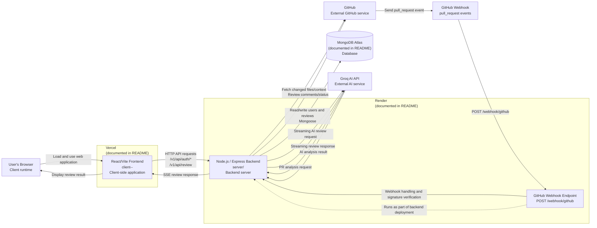

# AI Code Review System — Deployment Diagram

## 1. Overview

The AI Code Review System is deployed as a distributed web application consisting of a React/Vite frontend, a Node.js/Express backend, MongoDB Atlas, the Groq AI API, and GitHub integration.

The deployment architecture supports two major flows:

1. **Normal Code Review** — The user's browser communicates with the React frontend, which communicates with the backend. The backend interacts with MongoDB and Groq AI.
2. **GitHub Pull Request Review** — GitHub sends pull-request webhook events to the backend, which retrieves pull-request information, performs AI analysis, and posts review results back to GitHub.

The README documents the frontend deployment as **Vercel**, the backend deployment as **Render**, and the database as **MongoDB Atlas**.

## 2. Deployment Diagram



## 3. Deployment Components

### Client-Side Application

The React/Vite frontend is located in:

```text
client--
```

The README documents the frontend deployment as **Vercel**.

The user's browser loads the frontend from Vercel and executes the React application client-side.

Relevant frontend paths include:

```text
client--/src/main.jsx
client--/src/App.jsx
client--/src/pages
client--/src/components
client--/src/services
```

The frontend sends authenticated API requests to the backend with credentials included, allowing the JWT cookie to be sent.

---

### Backend Server

The Node.js/Express backend is located in:

```text
server
```

The README documents the backend deployment as **Render**.

The backend exposes:

```text
/v1/api/auth
/v1/api/review
/v1/api/users
/webhook/github
```

The backend is started by:

```text
server/server.js
```

The backend is responsible for:

- Authentication
- Code-review processing
- AI API communication
- Database operations
- GitHub integration
- GitHub webhook handling

---

### Database

The repository uses MongoDB through Mongoose.

Relevant files include:

```text
server/src/config/db.js
server/src/models/User.js
server/src/models/Review.js
```

The README documents the database deployment as **MongoDB Atlas**.

The backend connects to MongoDB using the:

```text
MONGO_URI
```

environment variable.

The database stores:

- User information
- Code-review records

---

### Groq AI API

The backend communicates with the external Groq API through:

```text
server/src/providers/groqProvider.js
```

The provider sends streaming chat-completion requests to Groq.

The generated review tokens are returned through the backend's Server-Sent Events (SSE) response to the frontend.

The normal AI flow is:

```text
Browser
   ↓
Vercel
   ↓
Render Backend
   ↓
groqProvider.js
   ↓
Groq AI API
   ↓
Render Backend
   ↓
SSE
   ↓
Vercel Frontend
   ↓
Browser
```

---

## 4. GitHub Pull Request Deployment Flow

GitHub provides the pull-request event that triggers the automated review process.

The webhook integration is implemented through:

```text
server/src/routes/webhookRoutes.js
server/src/controllers/webhookController.js
```

GitHub sends pull-request events to:

```text
POST /webhook/github
```

For `pull_request` events with `opened` or `synchronize` actions, the backend:

1. Verifies the webhook signature.
2. Retrieves changed files and related repository content.
3. Analyzes the changes.
4. Uses Groq for AI analysis.
5. Posts review results back to GitHub when issues are found.

The GitHub integration is handled primarily through:

```text
server/src/services/githubService.js
server/src/services/prReviewService.js
```

The deployment flow is:

```text
GitHub
   │
   │ pull_request event
   ▼
GitHub Webhook
   │
   │ POST /webhook/github
   ▼
Render Backend
   │
   ├── Verify webhook signature
   │
   ├── Fetch PR files/content
   │
   ├── Analyze PR changes
   │
   └── Request AI analysis
             │
             ▼
          Groq AI
             │
             ▼
       Review Result
             │
             ▼
        GitHub API
             │
             ▼
      Pull Request Review
```

---

## 5. Normal Code Review Deployment Flow

The normal code-review deployment flow is:

```text
User's Browser
       │
       ▼
Vercel
React/Vite Frontend
       │
       │ HTTP API
       ▼
Render
Node.js/Express Backend
       │
       ├───────────────► MongoDB Atlas
       │
       └───────────────► Groq AI API
                              │
                              ▼
                         AI Response
                              │
                              ▼
                       Render Backend
                              │
                              │ SSE
                              ▼
                       Vercel Frontend
                              │
                              ▼
                         User Browser
```

---

## 6. Authentication Deployment Flow

Authentication is handled between the frontend and the backend.

The general flow is:

```text
User
  │
  ▼
React/Vite Frontend
  │
  │ Authentication Request
  ▼
Render Backend
  │
  ▼
Authentication Services
  │
  ▼
MongoDB Atlas
```

After successful authentication, the backend uses a JWT stored in an HttpOnly cookie.

The frontend includes credentials in authenticated API requests so that the cookie can be sent to the backend.

---

## 7. Environment Configuration

The backend uses environment variables for important configuration values.

These include configuration for:

- MongoDB connection
- JWT authentication
- Groq API
- GitHub integration
- GitHub webhook verification

Environment configuration is handled through:

```text
server/src/config/envConfig.js
```

The MongoDB connection is handled through:

```text
server/src/config/db.js
```

---

## 8. Vercel Deployment

The frontend deployment is documented as Vercel.

The deployed frontend contains the React/Vite client application:

```text
client--
```

The browser executes the frontend application and communicates with the backend through HTTP requests.

The frontend also receives streamed review responses using SSE.

---

## 9. Render Deployment

The backend deployment is documented as Render.

The deployed backend contains:

```text
server/
```

The Render-hosted backend handles:

- REST API requests
- Authentication
- Code review requests
- SSE streaming
- GitHub webhook requests
- GitHub API communication
- Database operations
- AI API communication

The GitHub webhook endpoint runs as part of this backend deployment.

---

## 10. MongoDB Atlas Deployment

MongoDB Atlas provides the persistent database.

The backend connects to MongoDB through Mongoose.

The primary models are:

```text
User
Review
```

The database relationship is:

```text
User
 │
 │ 1
 │
 │ 0..*
 ▼
Review
```

The database stores persistent application data while the backend handles access through the Mongoose models.

---

## 11. External Service Dependencies

The deployed application depends on the following external services:

| Service | Purpose |
|---|---|
| Vercel | Frontend hosting |
| Render | Backend hosting |
| MongoDB Atlas | Database hosting |
| Groq AI API | AI-powered code analysis |
| GitHub | Repository and pull-request integration |

The deployment architecture therefore consists of hosted application components combined with external APIs and services.

---

## 12. Network Communication

The major communication paths are:

### Browser → Frontend

```text
Browser
   ↓
Vercel
```

The browser loads and executes the React/Vite application.

### Frontend → Backend

```text
Vercel Frontend
   ↓
Render Backend
```

The frontend sends API requests for authentication and code reviews.

### Backend → Database

```text
Render Backend
   ↓
MongoDB Atlas
```

The backend reads and writes users and reviews through Mongoose.

### Backend → Groq

```text
Render Backend
   ↓
Groq AI API
```

The backend sends code-review requests and receives AI-generated results.

### GitHub → Backend

```text
GitHub
   ↓
/webhook/github
   ↓
Render Backend
```

GitHub sends pull-request webhook events to the backend.

### Backend → GitHub

```text
Render Backend
   ↓
GitHub API
```

The backend retrieves pull-request context and can post review results.

---

## 13. Deployment Security

The deployment architecture includes several security mechanisms:

- JWT authentication.
- HttpOnly authentication cookies.
- JWT verification through authentication middleware.
- GitHub webhook signature verification.
- Environment variables for sensitive configuration.
- Password hashing using bcrypt.

Sensitive configuration such as API keys, database credentials, JWT secrets, and webhook secrets is handled through environment configuration rather than being directly embedded in application source code.

---

## 14. Deployment Responsibilities

| Component | Responsibility |
|---|---|
| User Browser | Executes frontend application |
| Vercel | Hosts React/Vite frontend |
| Render | Hosts Node.js/Express backend |
| MongoDB Atlas | Persistent data storage |
| Groq AI API | AI code analysis |
| GitHub | Repository and pull-request integration |
| GitHub Webhook | Sends pull-request events |

---

## 15. Current Deployment Architecture

The current deployment architecture can be summarized as:

```text
                         Internet
                            │
                            ▼
                    ┌──────────────┐
                    │ User Browser │
                    └──────┬───────┘
                           │
                           ▼
                    ┌──────────────┐
                    │    Vercel    │
                    │ React / Vite │
                    └──────┬───────┘
                           │
                     HTTP / SSE
                           │
                           ▼
                    ┌──────────────┐
                    │    Render    │
                    │ Node/Express │
                    └──────┬───────┘
                           │
              ┌────────────┼─────────────┐
              │            │             │
              ▼            ▼             ▼
       MongoDB Atlas   Groq AI API    GitHub API
              │                          ▲
              │                          │
              │                    PR Review
              │                          │
              └──────────────────────────┘

GitHub
   │
   │ pull_request webhook
   ▼
Render Backend
```

## 16. Deployment Limitations

The deployment locations described above are based on the project README.

The repository does not identify the GitHub webhook as a separately deployed service. It is treated as an endpoint running within the backend deployment.

The repository also does not provide deployment manifests for the hosting infrastructure in the analyzed source.

Therefore, the diagram represents the documented deployment architecture rather than independently verifying the current live infrastructure configuration.

## 17. Summary

The AI Code Review System uses a distributed deployment architecture:

```text
Frontend
   │
   │ Vercel
   ▼
Backend
   │
   ├── Render
   │
   ├── MongoDB Atlas
   │
   ├── Groq AI API
   │
   └── GitHub API
```

The normal code-review flow uses the browser, Vercel frontend, Render backend, Groq AI, and MongoDB Atlas.

The automated pull-request review flow uses GitHub webhooks, the Render backend, Groq AI, and the GitHub API.

The GitHub webhook endpoint is logically part of the backend deployment rather than a separately deployed application.