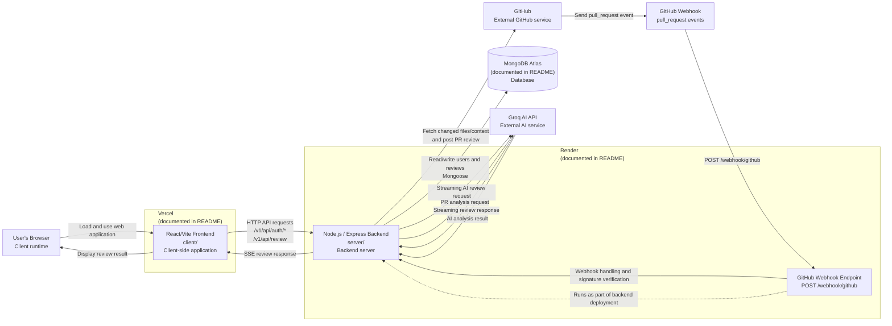

# AI Code Review System — Deployment Diagram

## 1. Overview

The AI Code Review System is deployed as a distributed web application consisting of a React/Vite frontend, a Node.js/Express backend, MongoDB Atlas, the Groq AI API, and GitHub integration.

The deployment architecture supports two major flows:

1. **Normal Code Review** — The user's browser communicates with the React frontend, which communicates with the backend. The backend interacts with MongoDB and Groq AI.
2. **GitHub Pull Request Review** — GitHub sends pull-request webhook events to the backend, which retrieves pull-request information, performs AI analysis, and posts review results back to GitHub.

The README documents the frontend deployment as **Vercel**, the backend deployment as **Render**, and the database as **MongoDB Atlas**.

## 2. Deployment Diagram



## 3. Deployment Components

### Client-Side Application (Vercel)

The React/Vite frontend is located in `client/` and is documented as deployed on **Vercel**. Relevant paths:

```text
client/src/main.jsx
client/src/App.jsx
client/src/pages
client/src/components
client/src/services
```

The frontend sends authenticated API requests to the backend with credentials included, so the JWT cookie is sent with each request.

### Backend Server (Render)

The Node.js/Express backend (`server/`, started by `server/server.js`) is documented as deployed on **Render**. It exposes:

```text
/v1/api/auth
/v1/api/review
/v1/api/users
/webhook/github
```

The backend is responsible for authentication, code-review processing, AI API communication, database operations, and GitHub integration (including webhook handling) — all within the same deployed service. The GitHub webhook endpoint is not a separately deployed service; it runs as a route within this backend.

### Database (MongoDB Atlas)

The backend connects to MongoDB Atlas via Mongoose, using the `MONGO_URI` environment variable. Relevant files:

```text
server/src/config/db.js
server/src/models/User.js
server/src/models/Review.js
```

The database stores user accounts and code-review records, related one-to-many:

```text
User (1) ──── (0..*) Review
```

### Groq AI Integration

The backend communicates with the external Groq API through `server/src/providers/groqProvider.js`, which sends streaming chat-completion requests. Generated review tokens are relayed to the frontend via the backend's SSE response (see the flow in Section 2).

## 4. Environment Configuration

The backend uses environment variables (validated in `server/src/config/envConfig.js`) for:

- MongoDB connection (`server/src/config/db.js`)
- JWT authentication
- Groq API access
- GitHub integration and webhook signature verification

## 5. External Services &amp; Responsibilities

| Component | Hosting / Location | Responsibility |
|---|---|---|
| React/Vite Frontend | Vercel | Client-side application, executed in the user's browser |
| Node.js/Express Backend | Render | REST API, authentication, review processing, GitHub webhook handling |
| MongoDB Atlas | MongoDB Atlas | Persistent storage for users and reviews |
| Groq AI API | External | AI-powered code analysis |
| GitHub / GitHub Webhook | External | Repository and pull-request integration; sends `pull_request` events |

## 6. Deployment Security

- JWT authentication with HttpOnly cookies, verified via authentication middleware
- GitHub webhook signature verification (`x-hub-signature-256`)
- Password hashing using bcrypt
- Sensitive configuration (API keys, database credentials, JWT secret, webhook secret) kept in environment variables rather than source code

## 7. Deployment Limitations

The deployment locations described above are based on the project README rather than independently verified live infrastructure. The GitHub webhook is not a separately deployed service — it runs as an endpoint within the backend deployment. No separate deployment manifests were available in the analyzed source.