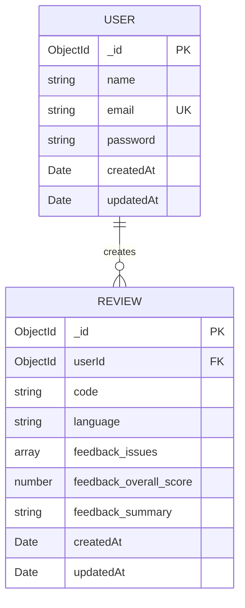

# AI Code Review System — ER Diagram

## 1. Overview

The AI Code Review System uses MongoDB with Mongoose for persistent data storage.

The repository contains two database models:

- `User`
- `Review`

A `User` can create multiple `Review` documents, while each `Review` belongs to exactly one `User`.

## 2. Entity Relationship Diagram



## 3. Database Technology

- **MongoDB** as the database, **Mongoose** as the ODM.
- MongoDB `ObjectId` values are used for document identifiers and references.
- Models are located in `server/src/models/` (`User.js`, `Review.js`).

## 4. User Entity

`server/src/models/User.js`

| Field | Type | Description | Constraint |
|---|---|---|---|
| `_id` | ObjectId | Document identifier | Primary Key |
| `name` | String | User's name | Required |
| `email` | String | User's email address | Required, Unique |
| `password` | String | bcrypt password hash (raw password is never stored) | Required |
| `createdAt` / `updatedAt` | Date | Managed automatically via `{ timestamps: true }` | Auto-generated |

## 5. Review Entity

`server/src/models/Review.js`

| Field | Type | Description | Constraint |
|---|---|---|---|
| `_id` | ObjectId | Document identifier | Primary Key |
| `userId` | ObjectId | Reference to the creating user | Required, Foreign Key → `User._id` |
| `code` | String | Source code submitted for review | Required |
| `language` | String | Programming language of the submitted code | Required |
| `feedback.issues` | Array | Issues identified during review — each item includes `line`, `severity`, `message`, and `fix` | — |
| `feedback.overall_score` | Number | Overall review score | — |
| `feedback.summary` | String | Summary of the AI-generated review | — |
| `createdAt` / `updatedAt` | Date | Managed automatically via `{ timestamps: true }` | Auto-generated |

> **Note:** `feedback` previously had a separate `suggestions` array alongside `issues`. That was consolidated — each issue's suggested fix is now stored as a `fix` field on the issue itself, and the standalone `suggestions` array was removed. Confirm this matches the current `Review.js` schema before finalizing the document.

## 6. Relationship

```text
USER (1) ──── (0..*) REVIEW
```

One `User` can have zero or many `Review` documents; each `Review` belongs to exactly one `User`. This is implemented via the `userId` reference in the `Review` model:

```javascript
userId: {
    type: mongoose.Schema.Types.ObjectId,
    ref: "User",
    required: true,
}
```

**Diagram legend:** `PK` = Primary Key, `UK` = Unique Key, `FK` = Foreign Key/reference. `||` = exactly one, `o{` = zero or many.

## 7. Example Documents

```json
{
    "_id": "ObjectId",
    "name": "Example User",
    "email": "user@example.com",
    "password": "bcrypt-hash",
    "createdAt": "Date",
    "updatedAt": "Date"
}
```

```json
{
    "_id": "ObjectId",
    "userId": "ObjectId",
    "code": "source code",
    "language": "javascript",
    "feedback": {
        "issues": [
            { "line": 12, "severity": "medium", "message": "...", "fix": "..." }
        ],
        "overall_score": 8.5,
        "summary": "Code review summary"
    },
    "createdAt": "Date",
    "updatedAt": "Date"
}
```

## 8. Scope

No additional database entities or relationships are defined in the analyzed Mongoose model files — `User` and `Review` are the complete database structure.git