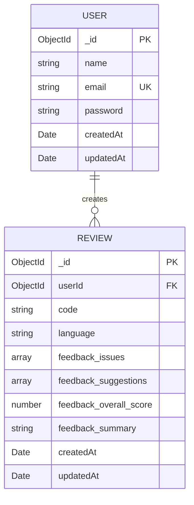

# AI Code Review System — ER Diagram

## 1. Overview

The AI Code Review System uses MongoDB with Mongoose for persistent data storage.

The repository contains two database models:

- `User`
- `Review`

A `User` can create multiple `Review` documents, while each `Review` belongs to exactly one `User`.

## 2. Entity Relationship Diagram



## 3. Database Technology

The application uses:

- **MongoDB** as the database.
- **Mongoose** as the Object Data Modeling (ODM) library.
- MongoDB `ObjectId` values for document identifiers and references.

The database models are located in:

```text
server/src/models/
├── User.js
└── Review.js
```

## 4. User Entity

The `USER` entity is defined in:

`server/src/models/User.js`

### Fields

| Field | Type | Description | Constraint |
|---|---|---|---|
| `_id` | ObjectId | Mongoose-generated document identifier | Primary Key |
| `name` | String | User's name | Required |
| `email` | String | User's email address | Required, Unique |
| `password` | String | Hashed user password | Required |
| `createdAt` | Date | Document creation timestamp | Automatically generated |
| `updatedAt` | Date | Last update timestamp | Automatically generated |

### Password Storage

The application does not store the raw password.

Passwords are hashed using bcrypt before being stored in the database.

Therefore, the `password` field contains the password hash rather than the original password.

### Timestamps

The `User` schema enables Mongoose timestamps:

```javascript
{ timestamps: true }
```

As a result, Mongoose automatically maintains:

```text
createdAt
updatedAt
```

## 5. Review Entity

The `REVIEW` entity is defined in:

`server/src/models/Review.js`

### Fields

| Field | Type | Description | Constraint |
|---|---|---|---|
| `_id` | ObjectId | Mongoose-generated document identifier | Primary Key |
| `userId` | ObjectId | Reference to the user who created the review | Required, Foreign Key |
| `code` | String | Source code submitted for review | Required |
| `language` | String | Programming language of the submitted code | Required |
| `feedback.issues` | Array | Issues identified during code review | — |
| `feedback.suggestions` | Array | Suggested improvements | — |
| `feedback.overall_score` | Number | Overall review score | — |
| `feedback.summary` | String | Summary of the AI-generated review | — |
| `createdAt` | Date | Document creation timestamp | Automatically generated |
| `updatedAt` | Date | Last update timestamp | Automatically generated |

## 6. Review Feedback Structure

The review feedback is stored as a nested object inside the `Review` document.

Conceptually, the structure is:

```text
Review
│
├── _id
├── userId
├── code
├── language
│
└── feedback
    ├── issues
    ├── suggestions
    ├── overall_score
    └── summary
```

The feedback contains the structured result produced by the AI code-review process.

## 7. Relationship Between User and Review

The relationship between the two entities is:

```text
USER 1 ──────────── 0..* REVIEW
```

This means:

- One `USER` can have zero or many `REVIEW` documents.
- Each `REVIEW` belongs to exactly one `USER`.

The relationship is implemented through the `userId` field in the `Review` model.

```javascript
userId: {
    type: mongoose.Schema.Types.ObjectId,
    ref: "User",
    required: true,
}
```

The `ref: "User"` establishes the Mongoose reference to the `User` model.

## 8. Relationship Explanation

### One User → Many Reviews

A registered user can submit multiple code-review requests.

For example:

```text
User A
│
├── Review 1
├── Review 2
├── Review 3
└── Review 4
```

Therefore, the relationship is:

```text
USER ||--o{ REVIEW
```

Where:

- `||` represents exactly one `USER`.
- `o{` represents zero or many `REVIEW` documents.

## 9. Primary Keys

Both entities use MongoDB/Mongoose-generated `ObjectId` identifiers.

```text
USER._id
REVIEW._id
```

These identifiers uniquely identify documents within their respective collections.

In the ER diagram:

- `PK` = Primary Key
- `UK` = Unique Key
- `FK` = Foreign Key / Reference

Therefore:

```text
USER._id       → Primary Key
REVIEW._id     → Primary Key
USER.email     → Unique Key
REVIEW.userId  → Foreign Key / Reference
```

## 10. Foreign Key / Reference

The `Review` entity contains:

```text
userId
```

This field references:

```text
User._id
```

Conceptually:

```text
Review.userId
      │
      ▼
User._id
```

Although MongoDB is a document database rather than a traditional relational database, this relationship is represented using a Mongoose `ObjectId` reference.

## 11. Collections

The two Mongoose models correspond to the application's main MongoDB collections:

```text
MongoDB
│
├── users
│
└── reviews
```

The exact collection naming behavior is handled by Mongoose based on the model definitions.

## 12. Example User Document

A conceptual `User` document has the following structure:

```json
{
    "_id": "ObjectId",
    "name": "Example User",
    "email": "user@example.com",
    "password": "bcrypt-hash",
    "createdAt": "Date",
    "updatedAt": "Date"
}
```

## 13. Example Review Document

A conceptual `Review` document has the following structure:

```json
{
    "_id": "ObjectId",
    "userId": "ObjectId",
    "code": "source code",
    "language": "javascript",
    "feedback": {
        "issues": [],
        "suggestions": [],
        "overall_score": 85,
        "summary": "Code review summary"
    },
    "createdAt": "Date",
    "updatedAt": "Date"
}
```

The `userId` value corresponds to the `_id` of the user who created the review.

## 14. Data Flow

The database interaction during a normal code review can be represented as:

```text
User
  │
  ▼
Submit Code
  │
  ▼
AI Code Review
  │
  ▼
Generate Feedback
  │
  ▼
Create Review Document
  │
  ▼
MongoDB
  │
  ▼
Review History
```

The review is associated with the authenticated user through `userId`.

## 15. Review History Relationship

When an authenticated user requests review history, the application uses the user's identity to retrieve their reviews.

Conceptually:

```text
Authenticated User
       │
       │ userId
       ▼
Review Collection
       │
       ▼
User's Reviews
```

This ensures that review history is associated with the corresponding user.

## 16. Complete Entity Structure

```text
┌─────────────────────────────┐
│            USER             │
├─────────────────────────────┤
│ PK _id : ObjectId           │
│    name : String            │
│ UK email : String           │
│    password : String        │
│    createdAt : Date         │
│    updatedAt : Date         │
└──────────────┬──────────────┘
               │
               │ 1
               │
               │
               │ 0..*
               ▼
┌─────────────────────────────┐
│           REVIEW            │
├─────────────────────────────┤
│ PK _id : ObjectId           │
│ FK userId : ObjectId        │
│    code : String             │
│    language : String         │
│    feedback.issues : Array   │
│    feedback.suggestions      │
│    feedback.overall_score    │
│    feedback.summary : String │
│    createdAt : Date          │
│    updatedAt : Date          │
└─────────────────────────────┘
```

## 17. Database Constraints

### User

- `name` is required.
- `email` is required.
- `email` is unique.
- `password` is required.
- Timestamps are automatically maintained.

### Review

- `userId` is required.
- `userId` references the `User` model.
- `code` is required.
- `language` is required.
- Timestamps are automatically maintained.

## 18. Database Scope

The repository contains these two database models:

```text
User
Review
```

No additional database entities or relationships are defined in the analyzed Mongoose model files.

Therefore, the current ER diagram represents the database structure implemented by the repository.

## 19. Summary

The AI Code Review System has a simple two-entity database structure:

```text
USER
  │
  │ 1
  │
  │ 0..*
  ▼
REVIEW
```

A `User` represents an authenticated application user, while a `Review` represents a code-review record generated for that user.

The relationship is implemented through:

```text
Review.userId → User._id
```

MongoDB provides document storage, while Mongoose provides schema definitions, validation, timestamps, and the reference between `User` and `Review`.