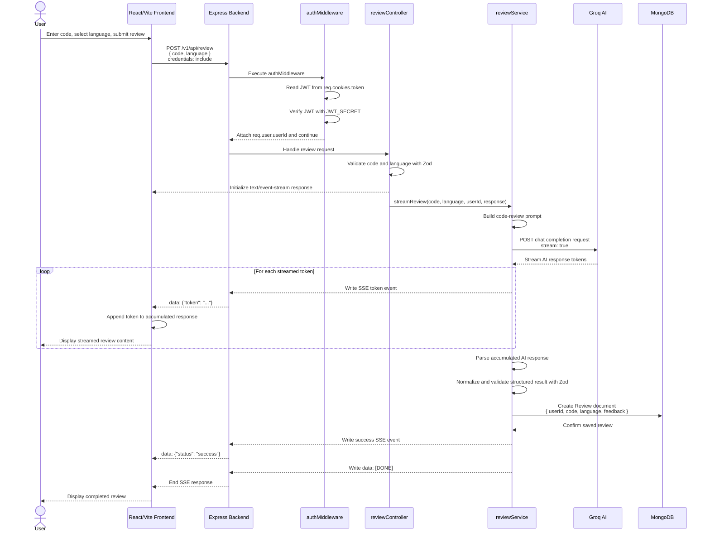

# AI Code Review System — Sequence Diagram

## 1. Overview

The sequence diagram describes the complete flow of a normal AI code-review request.

The flow begins when a user submits source code through the React/Vite frontend and ends when the completed review is displayed to the user after being validated and stored in MongoDB.

The main components involved are:

- User
- React/Vite Frontend
- Express Backend
- Authentication Middleware
- Review Controller
- Review Service
- Groq AI
- MongoDB

## 2. Sequence Diagram



## 3. Sequence Explanation

### Step 1 — User Submits Code

The user enters source code, selects a supported programming language, and submits the review request through the React/Vite frontend.

The frontend collects:

```text
code
language
```

and starts the review process.

### Step 2 — Frontend Sends Review Request

The frontend service:

```text
client--/src/services/reviewService.js
```

sends:

```text
POST /v1/api/review
```

The request includes credentials so that the JWT stored in the HttpOnly cookie is sent with the request.

### Step 3 — Authentication Middleware

The Express backend routes the request through:

```text
server/src/middleware/authMiddleware.js
```

The middleware:

1. Reads the JWT from `req.cookies.token`.
2. Verifies the JWT using `JWT_SECRET`.
3. Extracts the authenticated user's ID.
4. Attaches the user ID to `req.user`.
5. Allows the request to continue.

Conceptually:

```text
Request
   ↓
JWT Cookie
   ↓
authMiddleware
   ↓
JWT Verification
   ↓
Authenticated userId
```

### Step 4 — Review Controller

The request is handled by:

```text
server/src/controllers/reviewController.js
```

The controller validates the request body using Zod.

The supported languages are:

- JavaScript
- TypeScript
- Python
- Java
- C++

The controller then initializes an SSE response using:

```text
text/event-stream
```

### Step 5 — Start Review Service

The controller calls:

```text
streamReview(code, language, userId, response)
```

from:

```text
server/src/services/reviewService.js
```

The review service is responsible for the main AI-review processing.

### Step 6 — Build AI Prompt

The `reviewService.js` module builds the code-review prompt using the submitted:

```text
code
language
```

The prepared request is then passed to the AI provider.

### Step 7 — Send Request to Groq

The review service communicates with:

```text
server/src/providers/groqProvider.js
```

The provider sends a chat-completion request to the Groq AI service.

The request uses streaming:

```text
stream: true
```

This allows the AI response to be received incrementally rather than waiting for the complete response.

### Step 8 — Stream AI Response

Groq returns response tokens progressively.

The review service forwards these tokens through Server-Sent Events.

The frontend receives events such as:

```text
data: {"token": "..."}
```

The frontend continuously appends the received tokens to the accumulated review.

### Step 9 — Display Streaming Review

While the AI response is being generated, the frontend progressively displays the review content to the user.

Conceptually:

```text
Groq
  ↓
AI Token
  ↓
reviewService
  ↓
SSE
  ↓
Frontend
  ↓
Review UI
```

This provides a streaming review experience.

### Step 10 — Parse AI Response

After the AI streaming process completes, `reviewService.js` processes the accumulated response.

The service:

1. Extracts the structured response.
2. Normalizes the response.
3. Validates the resulting structure using Zod.

This ensures that the generated review follows the expected structure before it is stored.

### Step 11 — Save Review to MongoDB

After successful validation, the review service creates a `Review` document.

The stored information includes:

```text
userId
code
language
feedback
```

The database model is:

```text
server/src/models/Review.js
```

The review is stored in MongoDB.

Conceptually:

```text
ReviewService
     │
     ▼
Review Model
     │
     ▼
MongoDB
```

### Step 12 — Send Completion Events

After the review has been successfully stored, the backend sends a success SSE event:

```text
data: {"status": "success"}
```

The service then sends:

```text
data: [DONE]
```

The SSE response is subsequently closed.

### Step 13 — Display Completed Review

The frontend receives the completion event and finishes processing the review.

The completed review is displayed to the user.

The overall flow is:

```text
User
 ↓
React/Vite Frontend
 ↓
POST /v1/api/review
 ↓
authMiddleware
 ↓
reviewController
 ↓
reviewService
 ↓
Groq AI
 ↓
SSE Streaming
 ↓
Frontend
 ↓
Validate AI Response
 ↓
MongoDB
 ↓
Completion Event
 ↓
User
```

## 4. Components Involved

| Component | Responsibility |
|---|---|
| User | Submits source code and views the review |
| React/Vite Frontend | Sends requests and displays streamed results |
| `reviewService.js` | Handles frontend review API communication |
| Express Backend | Receives and routes API requests |
| `authMiddleware.js` | Verifies JWT authentication |
| `reviewController.js` | Validates request and starts the review |
| `reviewService.js` | Builds prompt, processes AI response, and saves review |
| `groqProvider.js` | Communicates with Groq AI |
| MongoDB | Stores users and completed reviews |

## 5. Authentication Sequence

The authentication part of the request can be summarized as:

```text
Frontend
   │
   │ Request + JWT Cookie
   ▼
Express Backend
   │
   ▼
authMiddleware
   │
   ├── Read token
   │
   ├── Verify JWT
   │
   └── Extract userId
   │
   ▼
reviewController
```

The authenticated `userId` is then passed to the review service so that the resulting review can be associated with the correct user.

## 6. AI Streaming Sequence

The AI streaming process is:

```text
reviewService
      │
      │ stream: true
      ▼
   Groq AI
      │
      │ tokens
      ▼
reviewService
      │
      │ SSE events
      ▼
Frontend
      │
      ▼
Review UI
```

This allows the user to see the AI-generated review while it is being produced.

## 7. Database Sequence

The persistence part of the flow occurs after the AI response has been processed:

```text
Groq AI
   ↓
Complete AI Response
   ↓
Parse
   ↓
Normalize
   ↓
Validate with Zod
   ↓
Review Model
   ↓
MongoDB
```

The saved review contains:

```text
userId
code
language
feedback
```

## 8. Error and Validation Points

The sequence contains several validation stages.

### Authentication Validation

The JWT must be present and valid.

```text
Invalid / Missing JWT
        ↓
Authentication Failure
```

### Request Validation

The review controller validates:

```text
code
language
```

using Zod.

### AI Response Validation

After the AI response is received, the review service normalizes and validates the structured result using Zod before storing it.

This prevents an invalid AI response from being directly persisted as a completed review.

## 9. Summary

The normal AI code-review sequence follows a layered request flow:

```text
User
  ↓
React/Vite Frontend
  ↓
Express Backend
  ↓
Authentication Middleware
  ↓
Review Controller
  ↓
Review Service
  ↓
Groq AI
  ↓
Streaming SSE Response
  ↓
Frontend
  ↓
Validate Structured Review
  ↓
MongoDB
  ↓
Completion Event
  ↓
User
```

The sequence demonstrates how authentication, request validation, AI streaming, structured-response validation, database persistence, and frontend result rendering work together to complete an AI code review.