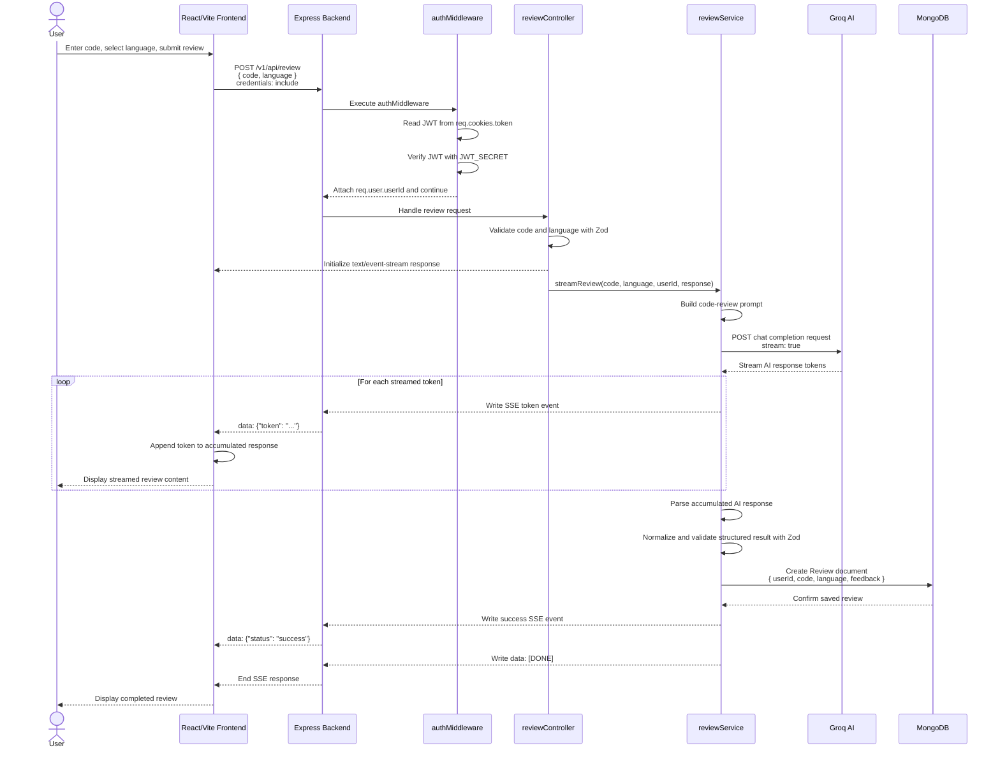

# AI Code Review System — Sequence Diagram

## 1. Overview

The sequence diagram describes the flow of an AI code-review request, from code submission through authentication, AI processing, SSE streaming, validation, database persistence, and completion.

### Main Components

* User
* React/Vite Frontend
* Express Backend
* Authentication Middleware
* Review Controller
* Review Service
* Groq AI
* MongoDB

## 2. Sequence Diagram



## 3. Sequence Flow

### Step 1 — Submit Review

The user enters source code, selects a programming language, and submits the review through the React/Vite frontend.

The frontend sends:

```text
POST /v1/api/review
```

with:

```text
code
language
```

The request includes credentials so the JWT stored in the HttpOnly cookie is sent to the backend.

### Step 2 — Authentication

The request passes through:

```text
server/src/middleware/authMiddleware.js
```

The middleware:

1. Reads the JWT from `req.cookies.token`.
2. Verifies it using `JWT_SECRET`.
3. Extracts the authenticated user's ID.
4. Attaches the ID to `req.user`.
5. Allows the request to continue.

### Step 3 — Review Controller

The request is handled by:

```text
server/src/controllers/reviewController.js
```

The controller:

* Validates `code` and `language` using Zod.
* Initializes the SSE response using `text/event-stream`.
* Calls:

```text
streamReview(code, language, userId, response)
```

from:

```text
server/src/services/reviewService.js
```

Supported languages:

* JavaScript
* TypeScript
* Python
* Java
* C++

### Step 4 — AI Review Processing

The review service builds the code-review prompt using the submitted code and language.

It communicates with:

```text
server/src/providers/groqProvider.js
```

The Groq request uses:

```text
stream: true
```

allowing the AI response to be received incrementally.

### Step 5 — SSE Streaming

As Groq returns tokens, the review service forwards them through Server-Sent Events.

The frontend receives events such as:

```text
data: {"token": "..."}
```

and progressively displays the generated review.

### Step 6 — Validate AI Response

After streaming completes, `reviewService.js`:

1. Parses the accumulated AI response.
2. Normalizes the response.
3. Validates the structured result using Zod.

Only a successfully validated result proceeds to persistence.

### Step 7 — Save Review

The review service creates a `Review` document containing:

```text
userId
code
language
feedback
```

The corresponding model is:

```text
server/src/models/Review.js
```

The document is stored in MongoDB.

### Step 8 — Completion

After the review is successfully stored, the backend sends:

```text
data: {"status": "success"}
```

followed by:

```text
data: [DONE]
```

The SSE connection is then closed, and the frontend completes the review display.

## 4. Components and Responsibilities

| Component             | Responsibility                                                  |
| --------------------- | --------------------------------------------------------------- |
| User                  | Submits source code and views the review                        |
| React/Vite Frontend   | Sends review requests and displays streamed results             |
| Express Backend       | Receives and routes API requests                                |
| `authMiddleware.js`   | Verifies JWT authentication                                     |
| `reviewController.js` | Validates the request and starts the review                     |
| `reviewService.js`    | Builds the prompt, processes the AI response, and saves reviews |
| `groqProvider.js`     | Communicates with Groq AI                                       |
| MongoDB               | Stores users and completed reviews                              |

## 5. Validation and Error Points

### Authentication

A missing or invalid JWT results in authentication failure.

### Request Validation

The review controller validates:

```text
code
language
```

using Zod.

### AI Response Validation

The review service normalizes and validates the structured AI response using Zod before saving it to MongoDB.

This prevents an invalid AI response from being persisted as a completed review.