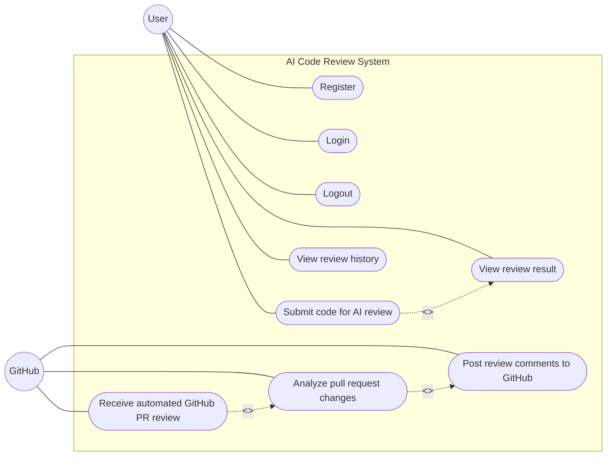

# AI Code Review System — Use Case Diagram

## 1. Overview

The AI Code Review System provides functionality for authenticated users to submit source code for AI-powered review, view review results, and access review history.

The system also integrates with GitHub to automatically analyze pull requests and post review comments when issues are identified.

The two primary actors are:

- **User**
- **GitHub**

## 2. Use Case Diagram



## 3. Actors

### User

The **User** interacts with the React/Vite frontend in `client--`.

The user can:

- Register an account.
- Log in.
- Log out.
- Submit source code for AI review.
- View the resulting review.
- View previous review history.

### GitHub

**GitHub** interacts with the backend through the GitHub webhook integration.

GitHub can:

- Send pull-request webhook events.
- Trigger automated pull-request analysis.
- Receive review comments posted back to a pull request.

GitHub authentication or OAuth is not included because the repository does not implement GitHub OAuth/login.

## 4. Use Cases

### Register

The registration functionality is implemented through:

`POST /v1/api/auth/register`

Backend logic:

`server/src/controllers/authController.js`

The registration process creates a user account and stores the user information in MongoDB.

### Login

The login functionality is implemented through:

`POST /v1/api/auth/login`

The authentication process:

1. Receives the user's credentials.
2. Validates the credentials.
3. Creates a JWT.
4. Stores the JWT in an HttpOnly cookie.

The JWT is subsequently used for authenticated requests.

### Logout

The logout functionality is implemented through:

`POST /v1/api/auth/logout`

The endpoint clears the JWT authentication cookie.

### Submit Code for AI Review

The user can submit source code for AI-powered analysis.

The functionality is implemented through:

`POST /v1/api/review`

Frontend service:

`client--/src/services/reviewService.js`

Backend route and controller:

`server/src/routes/reviewRoutes.js`

`server/src/controllers/reviewController.js`

The review request is authenticated before the backend processes it.

The backend sends the code to the AI review service and streams the generated review back to the frontend.

### View Review Result

After submitting code, the user receives the AI-generated review result.

The frontend receives the streamed response and displays the findings.

Relevant frontend files include:

`client--/src/components/ReviewPanel.jsx`

`client--/src/services/reviewService.js`

The review result can contain:

- Issues
- Suggestions
- Overall score
- Summary

### View Review History

Authenticated users can view their previous code reviews.

The functionality is implemented through:

`GET /v1/api/review`

Frontend page:

`client--/src/pages/HistoryPage.jsx`

The backend retrieves persisted reviews associated with the authenticated user.

The endpoint supports pagination and returns the user's review history.

### Receive Automated GitHub PR Review

GitHub can trigger an automated code review through a pull-request webhook.

The webhook endpoint is:

`POST /webhook/github`

The webhook route is defined in:

`server/src/routes/webhookRoutes.js`

The webhook handler is:

`server/src/controllers/webhookController.js`

Supported pull-request events include:

- `opened`
- `synchronize`

The webhook request is verified using the GitHub webhook signature before processing.

### Analyze Pull Request Changes

When a GitHub pull-request event is received, the system retrieves the relevant pull-request information.

GitHub integration is handled by:

`server/src/services/githubService.js`

The service retrieves changed files and related repository content.

PR-specific analysis is performed by:

`server/src/services/prReviewService.js`

The retrieved pull-request changes are then analyzed using the AI review system.

### Post Review Comments to GitHub

After analyzing the pull request, the system can post review comments back to GitHub.

The GitHub integration is handled by:

`server/src/services/githubService.js`

The webhook controller initiates the review process, and the resulting issues can be posted back to the corresponding GitHub pull request.

The current implementation posts a review when analyzed files contain issues.

## 5. Use Case Relationships

The main relationships between use cases are:

```text
Submit Code for AI Review
          │
          │ <<include>>
          ▼
    View Review Result
```

The GitHub workflow is:

```text
Receive Automated GitHub PR Review
              │
              │ <<include>>
              ▼
    Analyze Pull Request Changes
              │
              │ <<include>>
              ▼
      Post Review Comments
```

This represents the automated pull-request review flow.

## 6. User Interaction Flow

The normal user workflow can be summarized as:

```text
User
 │
 ├── Register
 │
 ├── Login
 │
 ├── Submit Code for AI Review
 │          │
 │          ▼
 │     View Review Result
 │
 ├── View Review History
 │
 └── Logout
```

## 7. GitHub Interaction Flow

The automated GitHub workflow can be summarized as:

```text
GitHub
  │
  ▼
Pull Request Event
  │
  ▼
Receive Automated PR Review
  │
  ▼
Analyze Pull Request Changes
  │
  ▼
AI Review
  │
  ▼
Post Review Comments
  │
  ▼
GitHub Pull Request
```

## 8. Use Case Summary

| Actor | Use Case | Implementation |
|---|---|---|
| User | Register | `POST /v1/api/auth/register` |
| User | Login | `POST /v1/api/auth/login` |
| User | Logout | `POST /v1/api/auth/logout` |
| User | Submit code for AI review | `POST /v1/api/review` |
| User | View review result | Frontend streamed review |
| User | View review history | `GET /v1/api/review` |
| GitHub | Receive automated PR review | `POST /webhook/github` |
| GitHub | Analyze pull request changes | `githubService.js` + `prReviewService.js` |
| GitHub | Receive review comments | `githubService.js` |

## 9. Scope and Limitations

The use cases represented in this diagram are based on functionality implemented in the repository.

The following are not represented as implemented use cases:

- GitHub OAuth/login.
- GitHub account authentication.
- Role-based administration.
- Password reset.
- Email verification.
- Dedicated admin functionality.

These features are not implemented in the current repository.

## 10. Summary

The AI Code Review System has two main interaction paths.

### User-driven review

```text
User
  ↓
Register / Login
  ↓
Submit Code
  ↓
AI Analysis
  ↓
View Review Result
  ↓
Review History
```

### GitHub-driven review

```text
GitHub
  ↓
Pull Request Webhook
  ↓
Analyze Changes
  ↓
AI Review
  ↓
Post Review Comments
```

The use case model therefore represents both the interactive code-review functionality provided to users and the automated pull-request review functionality integrated with GitHub.