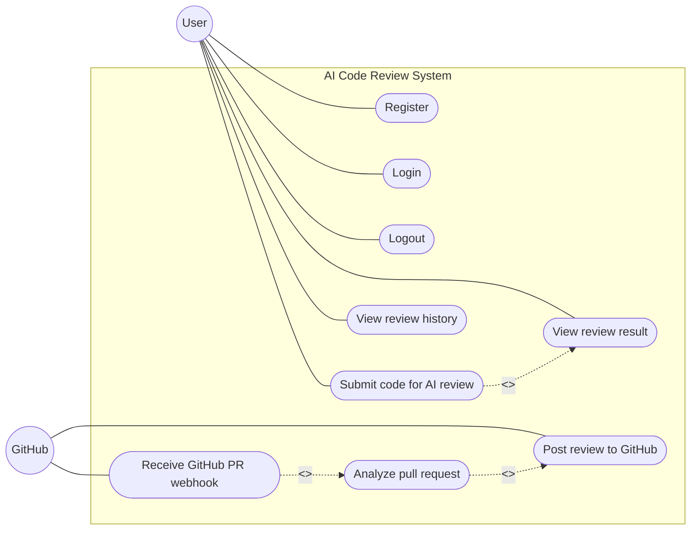

# AI Code Review System — Use Case Diagram

## 1. Overview

The AI Code Review System allows users to submit source code for AI-powered review, view review results, and access review history.

It also integrates with GitHub to automatically analyze pull requests and post review comments when issues are found.

### Actors

* **User** — interacts with the application through the frontend.
* **GitHub** — sends pull-request webhooks and receives automated review comments.

---

## 2. Use Case Diagram



---

## 3. Actors

### User

The user interacts with the React/Vite frontend and can:

* Register an account
* Log in
* Log out
* Submit source code for AI review
* View review results
* View review history

### GitHub

GitHub interacts with the backend through the webhook integration and can:

* Send pull-request events
* Trigger automated PR analysis
* Receive review comments

GitHub OAuth/login is not implemented.

---

## 4. Use Cases

### Register

**Endpoint:** `POST /v1/api/auth/register`

Creates a new user account and stores the user information in MongoDB.

**Implementation:** `server/src/controllers/authController.js`

---

### Login

**Endpoint:** `POST /v1/api/auth/login`

Authenticates the user and creates a JWT stored in an HttpOnly cookie.

**Implementation:** `server/src/controllers/authController.js`

---

### Logout

**Endpoint:** `POST /v1/api/auth/logout`

Clears the JWT authentication cookie.

**Implementation:** `server/src/controllers/authController.js`

---

### Submit Code for AI Review

**Endpoint:** `POST /v1/api/review`

The authenticated user submits source code for AI analysis. The backend processes the request and streams the generated review to the frontend.

**Implementation:**

* `client--/src/services/reviewService.js`
* `server/src/controllers/reviewController.js`
* `server/src/services/reviewService.js`

---

### View Review Result

The frontend displays the AI-generated review after code submission.

Results can contain:

* Issues
* Suggestions
* Overall score
* Summary

**Implementation:** `client--/src/components/ReviewPanel.jsx`

---

### View Review History

**Endpoint:** `GET /v1/api/review`

Authenticated users can retrieve their previous reviews. Results are associated with the authenticated user and support pagination.

**Implementation:** `client--/src/pages/HistoryPage.jsx`

---

### Receive GitHub PR Webhook

**Endpoint:** `POST /webhook/github`

GitHub sends pull-request events to trigger automated review processing.

Supported actions:

* `opened`
* `synchronize`

The webhook request is verified using the GitHub webhook signature.

**Implementation:** `server/src/controllers/webhookController.js`

---

### Analyze Pull Request

The system retrieves changed files and relevant repository content, then analyzes the pull request using the AI review system.

**Implementation:**

* `server/src/services/githubService.js`
* `server/src/services/prReviewService.js`

---

### Post Review to GitHub

When issues are identified, the system posts a review back to the corresponding GitHub pull request.

**Implementation:** `server/src/services/githubService.js`

---

## 5. Main Workflows

### User Workflow

```text
User
  ↓
Register / Login
  ↓
Submit Code
  ↓
AI Review
  ↓
View Result
  ↓
Review History
  ↓
Logout
```

### GitHub Workflow

```text
GitHub
  ↓
Pull Request Webhook
  ↓
Analyze Changes
  ↓
AI Review
  ↓
Post Review
  ↓
GitHub Pull Request
```

---

## 6. Use Case Summary

| Actor  | Use Case                  | Implementation                            |
| ------ | ------------------------- | ----------------------------------------- |
| User   | Register                  | `POST /v1/api/auth/register`              |
| User   | Login                     | `POST /v1/api/auth/login`                 |
| User   | Logout                    | `POST /v1/api/auth/logout`                |
| User   | Submit code for AI review | `POST /v1/api/review`                     |
| User   | View review result        | Frontend streamed review                  |
| User   | View review history       | `GET /v1/api/review`                      |
| GitHub | Receive PR webhook        | `POST /webhook/github`                    |
| GitHub | Analyze pull request      | `githubService.js` + `prReviewService.js` |
| GitHub | Receive review            | `githubService.js`                        |

---

## 7. Scope and Limitations

The current implementation does **not** include:

* GitHub OAuth/login
* GitHub account authentication
* Role-based administration
* Password reset
* Email verification
* Dedicated admin functionality

These features are outside the current implemented use cases.
